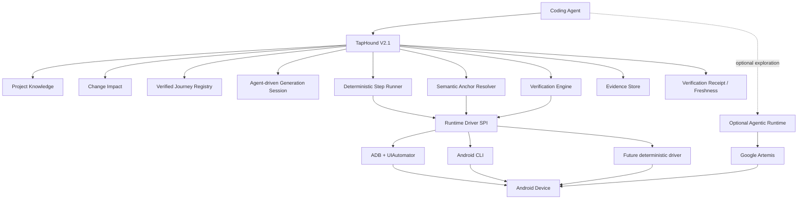

# TapHound V2.1 — AI-Free Project-Aware Runtime Verification

> **Status:** Architecture Baseline / V2 Evolution  
> **Date:** 2026-09-10  
> **Base:** TapHound V2 existing implementation  
> **Core principle:** AI-free Core, deterministic verification  
> **Primary goal:** Continue V2 instead of greenfield V3; strengthen semantics, reuse, change impact, and verification confidence.

---

# 0. Executive Decision

TapHound should **continue evolving from V2** instead of starting a greenfield V3.

The most important reason is architectural:

> **TapHound Core should remain AI-free.**

TapHound itself should not require:

```text
GEMINI_API_KEY
OPENAI_API_KEY
ANTHROPIC_API_KEY
or any other model credential
```

The AI belongs to the **external Coding Agent**.

TapHound remains a deterministic Android runtime verification tool that an AI Coding Agent can use.

The recommended architecture is:

```text
Coding Agent
   │
   │ reasoning / requirement understanding / coding
   │ Journey proposal / difficult recovery
   ▼
TapHound V2.1
   │
   ├── Project Knowledge
   ├── Semantic Anchors
   ├── Verified Journeys
   ├── Change Impact
   ├── Deterministic Replay
   ├── Assertions
   ├── Evidence
   └── Verdict
   │
   ▼
Runtime Driver
   │
   ├── ADB
   ├── UIAutomator
   ├── Android CLI
   └── optional external driver
   │
   ▼
Android Device
```

Optional agentic runtimes such as Google Artemis may be used for:

```text
Journey discovery
unknown UI exploration
difficult recovery
cross-app exploration
```

but they are **not required by TapHound Core** and are **not part of the deterministic happy path**.

The V2.1 direction can therefore be summarized as:

> **Keep the core AI-free.**  
> **Own project semantics and deterministic verification.**  
> **Use external AI only for generation, discovery, and bounded recovery.**

---

# 1. Why V2.1 Instead of V3

V3 was initially considered because modern mobile-agent frameworks increasingly provide:

- device control;
- UI observation;
- visual grounding;
- autonomous planning;
- recovery;
- trace collection;
- MCP integration.

A greenfield architecture would have delegated most execution to an agentic runtime such as Artemis.

However, current Artemis architecture introduces an additional LLM runtime. Artemis requires its own model provider configuration and therefore creates a stack like:

```text
Coding Agent
    ↓
TapHound
    ↓
Artemis
    ↓
Gemini / OpenAI / Anthropic
```

This has several drawbacks:

```text
second model dependency
second credential system
additional cost
additional latency
additional network dependency
additional nondeterminism
enterprise compliance overhead
duplicated reasoning
```

This is different from TapHound's original design:

```text
Coding Agent = intelligence
TapHound     = deterministic verification tool
```

That original boundary remains valuable.

V2 already contains much of the deterministic runtime infrastructure required for this architecture.

Therefore the preferred strategy is:

```text
DO:
  evolve V2
  simplify V2
  strengthen V2 semantics
  add change-awareness
  keep deterministic replay

DO NOT:
  restart the repository
  move the happy path to an embedded LLM agent
  duplicate general mobile-agent capabilities
```

---

# 2. V2.1 Product Definition

TapHound V2.1 is:

> **An AI-agent-friendly, AI-free Android runtime verification engine that converts project knowledge and verified user journeys into deterministic runtime proof.**

It answers:

```text
What screen am I on?
What semantic element does this runtime element represent?
Which verified path reaches the required state?
What should happen after this action?
Did the expected behavior actually occur?
What evidence proves it?
Did this code change affect an existing verified Journey?
Is an existing Journey or Anchor now stale?
```

It does **not** attempt to become a general autonomous mobile AI agent.

---

# 3. V2.1 Core Value

TapHound's value should be concentrated in four assets.

## 3.1 Project Knowledge

A persistent model of the Android project:

```text
Module
Feature
Screen
Semantic Anchor
State
Transition
Source Evidence
Verified Journey
```

---

## 3.2 Verified Journey Corpus

Reusable, versioned and verified user behaviors.

A Journey that has been successfully generated and verified should become an asset.

The next verification should replay it deterministically instead of asking an LLM to rediscover the path.

---

## 3.3 Deterministic Verification

Given:

```text
known state
known semantic action
known expected state
```

TapHound executes and verifies without using AI.

---

## 3.4 Change-Aware Regression Selection

Given a Git diff, TapHound should determine:

```text
which feature changed
which screens/transitions may be affected
which existing Journeys should run
which Journeys are unrelated and should be skipped
```

This becomes the major V2.1 addition.

---

# 4. Core Architectural Rule: Only One Required AI

The system should assume there is already an AI Coding Agent above TapHound.

For example:

```text
Claude Code
Codex
Gemini CLI
Cursor Agent
Custom Agent
Droid
other Coding Agent
```

That agent already performs:

```text
requirement analysis
code understanding
code modification
build orchestration
failure diagnosis
high-level planning
```

TapHound should not embed another model to repeat those tasks.

The ideal stack is:

```text
┌───────────────────────────────┐
│         Coding Agent          │
│                               │
│ Requirement reasoning         │
│ Source reasoning              │
│ Journey generation            │
│ Difficult recovery            │
└───────────────┬───────────────┘
                │ CLI / MCP
                ▼
┌───────────────────────────────┐
│        TapHound V2.1          │
│                               │
│ Project Knowledge             │
│ Semantic Anchor Resolution    │
│ Journey State                 │
│ Deterministic Execution       │
│ Assertions                    │
│ Evidence                      │
│ Verdict                       │
└───────────────┬───────────────┘
                │
                ▼
┌───────────────────────────────┐
│        Runtime Driver         │
│                               │
│ ADB / UIAutomator / CLI       │
└───────────────┬───────────────┘
                ▼
           Android Device
```

---

# 5. V2.1 Scope Boundary

## 5.1 TapHound owns

```text
Project Knowledge
Project Context lifecycle
Screen recognition
Semantic Anchor identity
Semantic Anchor resolution
State model
Transition model
Journey schema
Journey lifecycle
Journey deterministic replay
runtime assertions
evidence collection
PASS / FAIL / UNCERTAIN / ERROR
verification receipts
knowledge freshness
stale detection
change impact analysis
regression selection
benchmark
```

## 5.2 External Coding Agent owns

```text
natural-language requirement analysis
source-code reasoning
coding
build orchestration
initial Journey proposal
ambiguous semantic inference
complex diagnosis
high-level recovery strategy
```

## 5.3 Runtime Driver owns

```text
device discovery
app state
launch / terminate
UI hierarchy capture
screenshot
tap
long click
text input
swipe
back
low-level Android state
logcat retrieval
```

## 5.4 Optional Agentic Runtime owns

Examples:

```text
Google Artemis
future mobile agent
```

Responsibilities:

```text
unknown-path exploration
visual-only UI exploration
cross-app autonomous flow
recovery after deterministic path failure
candidate Journey discovery
```

This layer must remain optional.

---

# 6. V2.1 Overall Architecture



Critical rule:

> **The deterministic verification pipeline must work without OPTIONAL / Artemis.**

---

# 7. Existing V2 Architecture: What Stays

The current repository already uses a useful layering model:

```text
src/
  adapters/
  application/
  cli/
  domain/
  ports/
  shared/
```

Keep this architecture.

Do not start a new `src-v3` or parallel architecture.

V2.1 should be implemented incrementally inside the existing structure.

---

# 8. Existing V2 Components: Reuse Matrix

## 8.1 Project Context — KEEP AND EVOLVE

Current concepts worth preserving:

```text
context generation
module shards
project-relative source evidence
evidence hashes
semantic hashes
confidence
manifest
context refresh
context validation
```

V2.1 evolution:

```text
Project Context
    ↓
Project Knowledge
```

Do not rename everything immediately.

First extend the existing Project Context schema with semantic entities.

Recommended future concepts:

```text
Feature
Screen
Anchor
Transition
JourneyReference
SourceBinding
```

---

## 8.2 `UiSnapshotProvider` — KEEP

The current provider abstraction is useful.

It should remain the runtime observation boundary:

```ts
interface UiSnapshotProvider {
  capture(...): Promise<UiSnapshot>;
  close(): Promise<void>;
}
```

V2.1 should avoid turning this into an AI abstraction.

Its purpose is simple:

```text
device state
    ↓
normalized runtime snapshot
```

Possible implementations remain:

```text
system-uiautomator
android-cli
appium-uiautomator2
future deterministic provider
```

But V2.1 should stop investing equally in every backend.

---

# 9. Runtime Backend Strategy

The current runtime stack has grown across:

```text
ADB
Android CLI
Appium
UIAutomator
```

V2.1 should establish a preferred path.

Adopted priority (2026-09-10):

```text
P0:
  Mobile MCP (@mobilenext/mobile-mcp)
  — the preferred deterministic runtime path (`auto` resolves here)
  — no bundled LLM, stable protocol, one maintained driver path
  — capability gaps are being closed so the core commands run on it

P0 backup:
  direct ADB + system UIAutomator
  — kept available via `runtime.backend: "adb"` / `TAPHOUND_RUNTIME_BACKEND=adb`
  — the designated fallback while Mobile MCP still lacks process discovery

Maintenance only:
  Appium UiAutomator2
```

The goal is not backend breadth.

The goal is:

> **one reliable deterministic Android path.**

---

# 10. Semantic Anchor Becomes the Main Runtime Identity

This is one of the most important V2.1 changes.

Current execution may depend heavily on runtime locator information.

V2.1 should distinguish:

```text
Semantic Anchor
vs
Runtime Locator
```

## Semantic Anchor

Persistent and business meaningful:

```text
mail.search.input
mail.search.clear
mail.search.result.first
mail.detail.subject
mail.compose.send
calendar.event.save
```

## Runtime Locator

Temporary implementation detail:

```text
resource-id
text
content-desc
class name
bounds
UiAutomator node
Compose semantics
XPath
```

The relationship:

```text
Semantic Anchor
      ↓
Anchor Resolver
      ↓
fresh UiSnapshot
      ↓
runtime locator
      ↓
bounds / element
      ↓
action
```

Runtime locator information may be cached as evidence/hints, but must not replace semantic identity.

---

# 11. Anchor Schema

Recommended direction:

```yaml
id: mail.search.input

screen: mail.search.screen

role: text_input

semantics:
  intent: Search mailbox

sourceEvidence:
  files:
    - feature/mail/src/main/.../MailSearchFragment.kt

runtimeHints:
  resourceIds:
    - search_input

  text:
    - Search
    - 搜索

  contentDescriptions:
    - Search mail

confidence: cross_confirmed
```

Stable:

```text
id
screen
role
semantic intent
source relationship
```

Potentially unstable:

```text
resource ID
text
content description
geometry
hierarchy position
```

---

# 12. Anchor Resolution

Recommended resolver pipeline:

```text
Semantic Anchor
    ↓
fresh snapshot
    ↓
1. exact resource-id
    ↓
2. semantic/content description
    ↓
3. text
    ↓
4. structural relationship
    ↓
5. historical runtime hint
    ↓
unique candidate?
```

Results:

```text
RESOLVED
AMBIGUOUS
NOT_FOUND
STALE_HINT
```

Never silently pick a low-confidence candidate merely to continue execution.

For verification reliability:

```text
AMBIGUOUS → UNCERTAIN / recovery
NOT_FOUND → FAIL or STALE depending on context
```

---

# 13. Screen Recognition

V2.1 needs stable Screen identity.

A Screen is not necessarily equal to Android Activity.

Examples:

```text
MailHomeScreen
MailSearchScreen
MailDetailScreen
ComposeScreen
CalendarDayScreen
SettingsScreen
```

Multiple screens may exist inside one Activity.

Compose navigation and Fragment navigation make Activity-only modeling insufficient.

Recommended screen model:

```yaml
id: mail.search.screen

sourceEvidence:
  files:
    - MailSearchFragment.kt
    - MailSearchViewModel.kt

requiredAnchors:
  - mail.search.input

supportingAnchors:
  - mail.search.clear
  - mail.search.result.list

forbiddenAnchors:
  - mail.detail.subject
```

Recognition:

```text
required anchors satisfied
+
forbidden anchors absent
+
optional Activity/package hints
=
ScreenMatch
```

---

# 14. State Model

Screen and State must remain separate.

Example:

```text
Screen:
  mail.search.screen

States:
  mail.search.empty
  mail.search.typing
  mail.search.loading
  mail.search.results_visible
  mail.search.no_results
```

A Journey should reason about state, not only visible screen.

Example:

```yaml
state: mail.search.results_visible

requires:
  screen: mail.search.screen

anchors:
  required:
    - mail.search.result.list

conditions:
  - keyboard != blocking_expected_action
```

---

# 15. Transition Model

V2 transition modeling should evolve from Activity-centric transitions to semantic transitions.

Old style:

```text
fromActivity
actionResourceId
toActivity
```

Preferred style:

```yaml
id: mail.search.open_result

from:
  screen: mail.search.screen
  state: mail.search.results_visible

action:
  type: click
  anchor: mail.search.result.first

to:
  screen: mail.detail.screen

verification:
  requiredAnchors:
    - mail.detail.subject
```

A transition can later retain implementation evidence:

```text
navigation action
Fragment transaction
Compose route
Intent
```

but runtime semantics remain primary.

---

# 16. Journey V2.1

V2.1 should **keep executable steps**.

Do not reduce Journey to only:

```yaml
goal: Open search result
```

because that would require AI planning every run.

Instead:

```yaml
id: mail_search_open_result

version: 2

preconditions:
  - user.logged_in
  - mailbox.has_searchable_mail

start:
  screen: mail.home.screen

steps:
  - action: click
    anchor: mail.home.search

  - expect:
      screen: mail.search.screen

  - action: inputText
    anchor: mail.search.input
    value: "${search_query}"

  - expect:
      state: mail.search.results_visible

  - action: click
    anchor: mail.search.result.first

expectedOutcome:
  screen: mail.detail.screen

  assertions:
    - anchor: mail.detail.subject
      visible: true

    - condition: no.unexpected_error_dialog

verification:
  confidence: 0.98
  lastVerifiedCommit: abc123
```

The Journey remains deterministic because:

```text
steps are known
anchors are semantic
resolution is based on fresh state
assertions are explicit
```

---

# 17. Journey Is Not a Raw UI Script

Avoid:

```yaml
- click:
    x: 417
    y: 822

- wait: 1000

- click:
    xpath: //android.widget.TextView[3]
```

Prefer:

```yaml
- action: click
  anchor: mail.search.result.first
```

Coordinates belong only in:

```text
runtime snapshot
resolved action
evidence
debug report
```

They should not become the long-lived Journey identity.

---

# 18. Verified Journey Lifecycle

Recommended lifecycle:

```text
DRAFT
  ↓ successful deterministic replay
VERIFIED
  ↓ relevant source/UI change
SUSPECT
  ↓ successful replay
VERIFIED

SUSPECT
  ↓ cannot resolve / changed semantics
STALE

STALE
  ↓ regenerated/repaired + replayed
VERIFIED

VERIFIED
  ↓ feature removed
RETIRED
```

Each Journey should keep a verification receipt.

---

# 19. Verification Receipt

Example:

```yaml
journey: mail_search_open_result

verifiedAt:
  commit: abc123
  appVersion: 4.12.0
  timestamp: 2026-09-10T10:22:00+08:00

environment:
  androidApi: 35
  deviceClass: emulator

result: PASS

anchors:
  mail.search.input: resolved
  mail.search.result.first: resolved
  mail.detail.subject: resolved

evidence:
  runId: run_123
```

This becomes input for future stale detection and change impact.

---

# 20. Candidate Journey vs Verified Journey

An AI-generated Journey must not automatically become trusted project knowledge.

Lifecycle:

```text
Coding Agent proposes path
       ↓
Candidate Journey
       ↓
TapHound executes
       ↓
assertions pass with sufficient evidence
       ↓
Verified Journey
```

Only Verified Journeys can be automatically selected for regression.

Candidate Journey failures should remain generation evidence.

---

# 21. Generation Remains Agent-Driven

The current generation architecture is useful because the **external Agent** can reason while TapHound remains deterministic.

Keep the basic pattern:

```text
Agent
  ↓
generation start
  ↓
observe
  ↓
Agent proposes step
  ↓
TapHound validates/binds
  ↓
generation step
  ↓
fresh observation
```

TapHound should not introduce:

```text
LLM API client
model router
prompt executor
Gemini/OpenAI key
```

into Core.

---

# 22. Generation Engine Simplification

The current Generation subsystem has become relatively large.

V2.1 should avoid expanding it into a general agent runtime.

Keep:

```text
durable generation session
current runtime binding
snapshot references
proposed step validation
risk confirmation
recovery acknowledgement
final deterministic replay
publication only after verification
```

Reduce/defer:

```text
complex generic planning
generic self-healing
many special-case orchestration branches
runtime-provider-specific generation logic
```

The external Agent should perform difficult reasoning.

---

# 23. StepRunner — KEEP BUT NARROW

`StepRunner` is still valuable.

It should be responsible for:

```text
resolve semantic target
validate current state
perform deterministic action
wait for stabilization
capture resulting observation
evaluate immediate expectations
record evidence
```

It should not become responsible for:

```text
choosing the next business action
understanding natural-language goals
inventing a new route
LLM recovery
```

That distinction keeps the runtime deterministic.

---

# 24. Verification Engine

This remains a core TapHound asset.

Results:

```text
PASS
FAIL
UNCERTAIN
ERROR
```

## PASS

All mandatory evidence and assertions are satisfied.

## FAIL

Observed runtime behavior contradicts an explicit expected outcome.

Examples:

```text
expected screen not reached
required anchor missing
unexpected dialog appears
required state transition fails
logcat contains configured fatal signal
```

## UNCERTAIN

Execution finished but evidence is insufficient or ambiguous.

Examples:

```text
anchor matched multiple candidates
UI state cannot be uniquely recognized
snapshot backend failed to expose required semantics
runtime changed but expectation cannot distinguish correct/incorrect
```

## ERROR

Infrastructure failed.

Examples:

```text
ADB offline
device disconnected
provider crashed
snapshot timed out
configuration invalid
```

Critical rule:

> **Never convert infrastructure uncertainty into product PASS.**

---

# 25. Evidence First

Every PASS/FAIL should be explainable.

Possible evidence:

```text
runtime snapshot
screen recognition
resolved anchors
before/after state
screenshot
activity/package
logcat
action receipt
Journey hash
Project Knowledge hash
source evidence hash
```

A result should answer:

```text
What did TapHound expect?
What did it observe?
Which evidence supports the conclusion?
Which source/project knowledge caused this assertion to exist?
```

---

# 26. Knowledge Cache Instead of UI Cache

The current `UiKnowledgeCache` already contains useful concepts:

```text
semantic fingerprint
required/forbidden anchors
screen model
flow fragment
verification receipt
stale invalidation
telemetry
```

V2.1 should evolve this toward:

```text
Knowledge Cache
```

Cache:

```text
screen identities
anchor resolution hints
verified transition receipts
journey freshness
semantic fingerprints
known state contracts
```

Do not cache as authoritative truth:

```text
old bounds
old coordinates
raw stale hierarchy
temporary runtime node id
```

A fresh snapshot remains authoritative for geometry.

---

# 27. Change Impact — Major V2.1 Addition

This is the largest new capability in V2.1.

Goal:

```text
Git Diff
    ↓
Project Knowledge
    ↓
affected Feature / Screen / Transition
    ↓
Verified Journey Registry
    ↓
minimal meaningful regression set
```

Proposed command:

```bash
taphound impact --base origin/main --head HEAD
```

and eventually:

```bash
taphound verify-changes --base origin/main
```

---

# 28. ChangeSet

Domain model:

```ts
interface ChangeSet {
  base: string;
  head: string;

  files: ChangedFile[];

  affectedModules: ModuleId[];
}
```

Each file:

```ts
interface ChangedFile {
  path: string;
  status: "added" | "modified" | "deleted" | "renamed";

  oldPath?: string;

  changedSymbols?: SourceSymbolRef[];
}
```

P0 does not require perfect symbol-level parsing.

File/module mapping is enough to start.

---

# 29. Impact Resolution Algorithm

Use layered evidence.

## Layer 1 — Module mapping

```text
changed file
    ↓
Gradle module
```

Deterministic.

## Layer 2 — Source bindings in Project Knowledge

```text
changed file
    ↓
Feature / Screen / Anchor / Transition
```

High confidence.

## Layer 3 — semantic graph propagation

Example:

```text
MailSearchViewModel.kt
    ↓
feature: mail.search
    ↓
screen: mail.search
    ↓
transition: mail.search.open_result
    ↓
Journey: mail_search_open_result
```

## Layer 4 — optional Agent inference

If deterministic knowledge is incomplete:

```text
TapHound exposes unresolved impact
    ↓
external Coding Agent reasons from source
    ↓
candidate mapping
    ↓
stored as inferred evidence
```

TapHound itself still does not invoke a model.

---

# 30. ImpactSet

Example:

```yaml
base: origin/main
head: HEAD

affected:
  modules:
    - :feature:mail

  features:
    - id: mail.search
      confidence: source_confirmed

  screens:
    - id: mail.search.screen
      confidence: source_confirmed

  transitions:
    - id: mail.search.open_result
      confidence: inferred_from_graph

selectedJourneys:
  p0:
    - mail_search_open_result
    - mail_search_keyboard_collapse

  p1:
    - mail_search_basic

skippedJourneys:
  - calendar_create_event
  - compose_send_mail
```

Every selection should include:

```text
why selected
confidence
graph path
```

---

# 31. Regression Selection

Selection should be explainable and conservative.

## P0

Directly affected:

```text
changed source explicitly bound to Journey-covered transition
critical Journey bound to changed feature
```

## P1

Adjacent:

```text
same screen
same feature
shared transition
shared semantic anchor
```

## P2

Broad fallback:

```text
low-confidence impact
shared infrastructure component
project-wide behavior
```

Initial score:

```text
direct source binding
+ transition coverage
+ screen coverage
+ feature coverage
+ Journey criticality
+ stale risk
```

Avoid opaque ML ranking in V2.1.

---

# 32. Proposed `verify-changes`

Target developer experience:

```bash
taphound verify-changes \
  --project /path/to/project \
  --base origin/main \
  --head HEAD
```

Pipeline:

```text
Git diff
    ↓
Impact Analysis
    ↓
Regression Selection
    ↓
Verified Journey Replay
    ↓
Evidence
    ↓
Verdict
    ↓
Verification Receipts
```

Output example:

```text
Changed
  M MailSearchFragment.kt
  M MailSearchViewModel.kt

Affected
  mail.search
  mail.search.screen
  mail.search.open_result

Selected Journeys
  [P0] mail_search_open_result
       reason: directly covers affected transition

  [P0] mail_search_keyboard_collapse
       reason: same screen + changed ViewModel

  [P1] mail_search_basic
       reason: feature-level regression

Results
  PASS mail_search_open_result
  PASS mail_search_basic
  FAIL mail_search_keyboard_collapse

Overall
  FAIL
```

---

# 33. Project Knowledge V2.1

Do not immediately replace all current Project Context files.

Recommended staged evolution.

Current:

```text
.taphound/context/
  project-context.json
  modules/*.json
```

Add semantic data incrementally:

```text
module
  ├── features
  ├── screens
  ├── anchors
  └── transitions
```

Later, if size/ownership requires:

```text
.taphound/knowledge/
```

can become a future format migration.

Avoid schema churn before the semantics prove useful.

---

# 34. Knowledge Confidence

Recommended confidence levels:

```text
sourceConfirmed
runtimeConfirmed
crossConfirmed
inferred
unknown
stale
```

Meanings:

### sourceConfirmed

Static project evidence exists.

### runtimeConfirmed

Observed and verified at runtime.

### crossConfirmed

Both source and runtime evidence agree.

### inferred

External Agent or graph inference only.

### unknown

Insufficient evidence.

### stale

Previously trusted evidence was invalidated.

This extends the existing confidence idea instead of inventing an unrelated model.

---

# 35. Stale Detection

A semantic object may become stale when:

```text
source evidence hash changes
bound file removed/renamed
anchor no longer resolves
screen fingerprint changes
transition destination changes
verified Journey repeatedly fails
Journey has not been reverified after relevant impact
```

Recommended states:

```text
fresh
suspect
stale
```

Do not automatically delete stale knowledge.

Stale knowledge is useful for diagnosis and regeneration.

---

# 36. Runtime Recovery

Recovery must remain bounded.

Recommended deterministic recovery sequence:

```text
1. recapture fresh snapshot
2. re-recognize screen/state
3. retry anchor resolution
4. dismiss known deterministic interruption if policy allows
5. retry idempotent action if safe
6. fail / mark uncertain
```

Do not create an endless autonomous recovery loop.

After deterministic recovery fails:

```text
return structured failure to Coding Agent
```

The Agent may then choose:

```text
manual correction
new generation step
Artemis exploration
new Journey generation
```

---

# 37. Optional Artemis Integration

Artemis remains useful, but its architectural role changes.

It is:

```text
optional exploration/recovery service
```

not:

```text
TapHound default runtime
```

Use cases:

```text
unknown path discovery
UI redesign investigation
system-app / picker exploration
visual-only interface
difficult recovery
candidate Journey creation
```

Artemis currently uses its own model provider configuration, so enabling Artemis means accepting an additional AI dependency.

That must never be required for:

```text
taphound verify
taphound record
taphound observe
taphound verify-changes
deterministic Journey replay
```

---

# 38. Artemis Custom Agent MCP Configuration

If a development environment chooses to use Artemis, it can remain mounted directly into the Coding Agent.

Example:

```json
{
  "experimental": {
    "modelContextProtocolServers": [
      {
        "name": "artemis",
        "transport": {
          "type": "stdio",
          "command": "/Users/caikai/User/Project/PythonProjects/artemis/.venv/bin/python",
          "args": [
            "-m",
            "mcp_server"
          ],
          "env": {
            "PYTHONUNBUFFERED": "1",
            "PYTHONPATH": "/Users/caikai/User/Project/PythonProjects/artemis"
          }
        }
      }
    ]
  }
}
```

Important architecture:

```text
Custom Coding Agent
    ├── TapHound tools
    │      deterministic verification
    │
    └── Artemis MCP
           optional autonomous exploration
```

Not:

```text
TapHound
   ↓ mandatory
Artemis
```

---

# 39. External Agent Recovery Pattern

Recommended future workflow:

```text
taphound verify
      ↓
ANCHOR_NOT_FOUND
      ↓
structured failure
      ↓
Coding Agent
      ↓
optional Artemis exploration
      ↓
Agent discovers new UI route
      ↓
generation repair
      ↓
TapHound deterministic replay
      ↓
Verified Journey updated
```

Important:

> Artemis discovers. TapHound verifies.

A successful Artemis task is not sufficient to update a Verified Journey.

The new Journey must still pass deterministic replay.

---

# 40. MCP Positioning

TapHound may expose its own MCP tools in the future, but MCP is only an integration protocol.

It is not TapHound's domain model.

Recommended MCP surface should remain high-level:

```text
taphound_observe
taphound_context_status
taphound_generation_start
taphound_generation_step
taphound_generation_status
taphound_verify
taphound_impact
taphound_verify_changes
```

Avoid exposing every internal ADB primitive through TapHound MCP unless needed.

If the Coding Agent wants low-level exploration, it can use another device MCP directly.

---

# 41. CLI V2.1

Keep existing commands while adding a small change-aware surface.

Existing important commands:

```text
doctor
observe
record
verify

context list
context validate
context status
context refresh

generation start
generation observe
generation step
generation status
generation finalize
generation recover

journey resolve
journey list-flows
```

V2.1 additions:

```text
impact
verify-changes
journey status
journey mark-stale
```

Possible commands:

```bash
taphound impact --base origin/main

taphound verify-changes --base origin/main

taphound journey status mail_search_open_result
```

Do not add a large new CLI tree until these workflows stabilize.

---

# 42. Workspace Layout

Keep current layout for compatibility:

```text
<project>/
  .taphound/
    config.json

    context/
      project-context.json
      modules/*.json

    flows/
    sources/
    journeys/

    build/
      generations/
      jobs/
      runs/
      cache/
```

V2.1 additions can fit without a migration:

```text
.taphound/
  impacts/
```

or preferably ephemeral:

```text
.taphound/build/impacts/
```

Journey verification receipts can initially remain sidecars:

```text
journeys/
  search.json
  search.meta.json
```

Extend the metadata rather than introduce another store immediately.

---

# 43. Current Code Direction

## Keep and strengthen

```text
src/domain/project-context.ts
src/application/context/*
src/domain/journey.ts
src/application/runtime/*
src/application/ui/ui-knowledge-cache.ts
src/domain/report.ts
src/ports/ui-snapshot.ts
```

## Simplify

```text
src/application/generation/*
src/application/interaction/*
src/application/locator/*
src/application/wait/*
```

Goal:

```text
less orchestration
more explicit contracts
```

## Maintenance / lower priority

```text
src/adapters/appium/*
external flows
camera alignment
generic bridge expansion
```

## New V2.1 modules

```text
src/domain/impact.ts

src/application/impact/
  change-set-builder.ts
  impact-resolver.ts
  regression-selector.ts

src/adapters/git/
  git-diff-provider.ts
```

Optional:

```text
src/domain/semantic-anchor.ts
src/domain/screen.ts
src/domain/transition.ts
```

These may first remain inside Project Context if avoiding premature file proliferation is preferred.

---

# 44. Proposed New Interfaces

## Git diff

```ts
export interface GitDiffProvider {
  getChangeSet(input: {
    projectRoot: string;
    base: string;
    head: string;
  }): Promise<ChangeSet>;
}
```

## Impact Resolver

```ts
export interface ImpactResolver {
  resolve(input: {
    changeSet: ChangeSet;
    context: ProjectContext;
    journeys: VerifiedJourney[];
  }): Promise<ImpactSet>;
}
```

## Regression Selector

```ts
export interface RegressionSelector {
  select(
    impact: ImpactSet,
    journeys: VerifiedJourney[]
  ): RegressionSelection;
}
```

These interfaces require no AI implementation.

---

# 45. Journey Compatibility Strategy

Do not immediately break current Journey v1 files.

Recommended approach:

```text
Journey v1
    current locator/action schema

Journey v2.1 extensions
    semanticAnchor
    state expectation
    verification metadata
```

During transition, one step can support:

```yaml
action: click

anchor: mail.search.input

fallbackLocator:
  resourceId: search_input
```

Then gradually move toward:

```yaml
action: click
anchor: mail.search.input
```

The compatibility layer resolves old Journey files without forcing a repository-wide migration.

---

# 46. Migration Strategy

V2.1 should be incremental.

## Phase A — semantic metadata without behavior change

Add:

```text
Screen IDs
Anchor IDs
Transition IDs
Journey metadata
```

Existing replay still works.

## Phase B — semantic resolution

Allow Journey step:

```text
anchor
```

instead of direct locator.

## Phase C — stale/fresh lifecycle

Verification receipts update semantic knowledge.

## Phase D — change impact

Add:

```text
Git Diff → Journey selection
```

## Phase E — reduce legacy locator coupling

Only after semantic replay passes benchmark.

This minimizes regression risk.

---

# 47. V2.1 P0

P0 goal:

> **A known Verified Journey can be replayed deterministically using Semantic Anchors, without any model API key.**

Required:

```text
Screen model
Anchor model
Anchor resolver
Journey anchor step
fresh snapshot
deterministic action
expected outcome
PASS / FAIL / UNCERTAIN
evidence
```

Example:

```text
mail_search_open_result
```

must run end-to-end with no external AI once the Journey exists.

---

# 48. V2.1 P1 — Change-Aware Verification

Goal:

> **Given a Git change, automatically select and replay the relevant Verified Journeys.**

Pipeline:

```text
Git Diff
    ↓
Project Context
    ↓
Impact Resolver
    ↓
Regression Selector
    ↓
Verified Journey Replay
```

Target command:

```bash
taphound verify-changes --base origin/main
```

This is likely the most important user-facing addition in V2.1.

---

# 49. V2.1 P2 — Knowledge Flywheel

Add:

```text
verification receipts
anchor runtime history
screen fingerprints
transition history
Journey freshness
stale detection
```

After every run:

```text
verify
  ↓
evidence
  ↓
receipt
  ↓
knowledge update
```

The next run becomes more informed without adding an LLM.

---

# 50. V2.1 P3 — Agent-Assisted Discovery

Only after deterministic P0/P1 are stable.

Examples:

```text
Coding Agent creates missing Journey
Coding Agent repairs stale Journey
Artemis explores unknown path
Agent proposes new Anchor mapping
```

All candidate knowledge must still be verified deterministically before promotion.

---

# 51. First Vertical Slice

Use one existing scenario.

Recommended:

```text
Mail Search → Search Result → Mail Detail
```

Build:

```text
Feature:
  mail.search

Screens:
  mail.home
  mail.search
  mail.detail

Anchors:
  mail.home.search
  mail.search.input
  mail.search.result.first
  mail.detail.subject

Transitions:
  mail.home.open_search
  mail.search.open_result
```

Journey:

```text
mail_search_open_result
```

Acceptance:

```text
1. existing Journey can be expressed with semantic anchors
2. no AI API key is required
3. fresh UiSnapshot resolves every action
4. replay reaches Mail Detail
5. subject assertion passes
6. run stores evidence
7. changing resource IDs can be handled by updating Anchor evidence
8. Journey semantic identity stays unchanged
```

---

# 52. Second Vertical Slice — Change Impact

Modify:

```text
MailSearchViewModel.kt
```

Expected:

```text
affected feature:
  mail.search

selected:
  mail_search_open_result
  mail_search_basic

not selected:
  compose_send
  calendar_create
```

Acceptance:

```text
selection is explainable
no model is called
unrelated Journeys are skipped
selected Journeys replay deterministically
```

---

# 53. Benchmark V2.1

Keep the planned fixed benchmark set.

Recommended 20 cases in four groups.

## A. Snapshot / Anchor Resolution — 5

```text
A1 XML screen
A2 Compose screen
A3 hybrid screen
A4 scroll target
A5 dynamic list item
```

Measure:

```text
anchor resolution accuracy
ambiguity rate
resolution latency
```

## B. Verified Journey Replay — 5

```text
B1 simple navigation
B2 text input
B3 keyboard-related flow
B4 dialog
B5 multi-screen flow
```

Measure:

```text
first-run replay success
deterministic retry success
false PASS
```

## C. Change Impact — 5

```text
C1 UI file
C2 ViewModel
C3 navigation
C4 repository/data
C5 shared component
```

Measure:

```text
impact precision
impact recall
Journey selection precision
Journey selection recall
```

## D. Stale Knowledge — 5

```text
D1 resource ID rename
D2 text change
D3 screen redesign
D4 transition change
D5 removed feature
```

Measure:

```text
stale detection precision
stale detection recall
Journey repair success
```

---

# 54. Key Metrics

Primary:

```text
False PASS Rate
Verified Journey Replay Success
Anchor Resolution Accuracy
```

V2.1 new metrics:

```text
Impact Precision
Impact Recall
Regression Selection Recall
Redundant Journey Ratio
Stale Detection Accuracy
```

Operational:

```text
verification latency
snapshot latency
Journey generation LLM calls
recovery count
```

Once a Journey is verified:

```text
LLM calls for normal replay = 0
```

This should be a headline metric.

---

# 55. Definition of Success

V2.1 succeeds when this workflow is reliable:

```text
Developer asks Coding Agent to modify Android behavior
        ↓
Agent edits code
        ↓
Agent builds + installs
        ↓
Agent calls TapHound
        ↓
TapHound identifies affected Verified Journeys
        ↓
TapHound replays them deterministically
        ↓
TapHound returns structured evidence
        ↓
Agent fixes code if necessary
```

The runtime verification stage itself requires:

```text
zero model API keys
zero embedded model calls
```

---

# 56. Architecture Guardrails

Before adding any new V2.1 feature, ask:

1. Does this improve deterministic verification?
2. Does it improve Project Knowledge?
3. Does it improve semantic stability?
4. Does it improve Journey reuse?
5. Does it improve change impact/regression selection?
6. Can the external Coding Agent already perform this reasoning?
7. Does this require adding a model dependency into Core?
8. Is this generic Android plumbing already handled elsewhere?

If a feature mainly adds:

```text
LLM planning
vision reasoning
generic autonomous navigation
generic autonomous recovery
```

it likely belongs outside TapHound Core.

---

# 57. Features to Stop Expanding

Do not prioritize:

```text
generic mobile planner
embedded LLM
model provider router
Gemini/OpenAI/Anthropic integration
generic visual grounding engine
generic OCR pipeline
full Appium parity
more Android runtime providers
cross-app automation framework
generic system-app automation
general-purpose MCP device server
```

The goal is not to compete with Artemis.

---

# 58. Features to Prioritize

Priority order:

```text
1. Semantic Anchor
2. Screen / State Recognition
3. Deterministic Journey Replay
4. Verification Evidence
5. Verified Journey Lifecycle
6. Project Knowledge freshness
7. Change Impact
8. Regression Selection
9. Benchmark
10. Agent-assisted discovery/recovery
```

---

# 59. Recommended Near-Term Development Plan

## Step 1 — Freeze current behavior benchmark

Before changing Journey/Anchor semantics, capture current replay behavior.

## Step 2 — Introduce Semantic Anchor model

Do not replace locators yet.

Allow both:

```text
anchor + locator fallback
```

## Step 3 — Add Screen semantic identity

Start with a few benchmark screens.

## Step 4 — Update StepRunner

Resolve:

```text
anchor → live element
```

before action.

## Step 5 — Add Journey verification receipts

Mark:

```text
verified / suspect / stale
```

## Step 6 — Implement GitDiffProvider

Use normal local Git; no AI.

## Step 7 — Implement ImpactResolver

File/module/source binding first.

## Step 8 — Implement RegressionSelector

Explainable scoring only.

## Step 9 — Add `taphound impact`

Validate selection quality before auto-running.

## Step 10 — Add `taphound verify-changes`

Connect impact to deterministic replay.

## Step 11 — Add external Agent recovery protocol

Return structured data sufficient for the Coding Agent to repair stale Journeys.

## Step 12 — Evaluate optional Artemis workflow

Only for scenarios where external autonomous exploration materially improves generation/recovery.

---

# 60. Proposed Error Model Additions

Useful V2.1 error codes:

```text
SCREEN_NOT_RECOGNIZED
ANCHOR_NOT_FOUND
ANCHOR_AMBIGUOUS
ANCHOR_STALE
TRANSITION_NOT_REACHED
JOURNEY_SUSPECT
JOURNEY_STALE

IMPACT_UNKNOWN
IMPACT_LOW_CONFIDENCE
NO_VERIFIED_JOURNEY
REGRESSION_SELECTION_EMPTY

EVIDENCE_INSUFFICIENT
RUNTIME_PROVIDER_ERROR
```

These should be machine-readable for Coding Agents.

---

# 61. Structured Failure for Agent Recovery

Example:

```json
{
  "status": "uncertain",
  "code": "ANCHOR_NOT_FOUND",

  "journey": "mail_search_open_result",

  "step": {
    "index": 2,
    "anchor": "mail.search.result.first"
  },

  "observed": {
    "screen": "mail.search.screen",
    "state": "mail.search.results_visible"
  },

  "recovery": {
    "agentActionSuggested": true,
    "reason": "Semantic screen still matches, but the verified target no longer resolves."
  },

  "evidence": {
    "snapshotRef": "...",
    "screenshot": "..."
  }
}
```

This is more useful than embedding an LLM inside TapHound.

---

# 62. CI Positioning

AI-free Core makes TapHound suitable for CI.

CI can run:

```bash
taphound verify-changes \
  --base "$MERGE_BASE" \
  --head HEAD \
  --device emulator-5554 \
  --json
```

No secret model key is required.

Only normal runtime prerequisites:

```text
Node
ADB
Android SDK
device/emulator
target app
```

This is a meaningful competitive advantage.

---

# 63. Enterprise Positioning

For restricted environments:

```text
no external LLM endpoint
no AI API credential
no screenshots uploaded to model provider
no code sent to external AI by TapHound
```

TapHound can still perform deterministic verification.

An enterprise can separately choose its own Coding Agent or self-hosted model.

This separation should remain an explicit design goal.

---

# 64. Relationship With Artemis

The correct positioning is:

```text
Artemis
=
General-purpose AI mobile agent

TapHound
=
Project-aware deterministic verification engine
```

They can cooperate:

```text
Artemis
  discovers a new path
      ↓
TapHound
  converts/stores semantic Journey
      ↓
TapHound
  verifies it deterministically
      ↓
future regression
  no Artemis required
```

This is complementary without creating a hard dependency.

---

# 65. Relationship With Mobile MCP / Other Drivers

Mobile MCP is the **adopted** deterministic Runtime Driver (decision
2026-09-10). It qualifies on every criterion:

```text
it reduces maintenance — yes
it works without its own LLM — yes
its protocol is sufficiently stable — yes
it improves reliability — yes
```

ADB remains the backup path for capability gaps
(`runtime.backend: "adb"` / `TAPHOUND_RUNTIME_BACKEND=adb`) — a supported
deterministic driver, not the primary one.

No third-party runtime reference should leak into persistent semantic identity.

---

# 66. Naming

Recommended release naming:

```text
TapHound V2.1
```

Internal description:

```text
AI-Free Project-Aware Runtime Verification
```

Do not call this V3 because:

```text
core architecture remains V2 lineage
repository remains intact
Journey/runtime remain deterministic
existing Context/Generation/Replay concepts remain
changes are evolutionary rather than a complete platform rewrite
```

Reserve V3 for a real architectural discontinuity such as:

```text
multi-platform Android+iOS
remote distributed device service
standalone long-lived TapHound daemon
project knowledge server/graph service
organization-wide verification intelligence
```

---

# 67. Final Architecture Decision

TapHound V2.1 should preserve the strongest property of the existing design:

> **TapHound can verify an Android app without knowing how to call an LLM.**

The external Coding Agent supplies intelligence.

TapHound supplies:

```text
project semantics
deterministic execution
runtime truth
evidence
verification
```

The architecture becomes:

```text
                Coding Agent
                REQUIRED AI
                    │
          ┌─────────┴─────────┐
          │                   │
          ▼                   ▼
     TapHound V2.1      Optional Artemis
          │              discovery/recovery
          │
          │ deterministic
          ▼
     Runtime Driver
          │
          ▼
     Android Device
```

Normal verification:

```text
Code Change
    ↓
Project Knowledge
    ↓
Impact Analysis
    ↓
Verified Journey Selection
    ↓
Semantic Anchor Resolution
    ↓
Deterministic Replay
    ↓
Evidence
    ↓
PASS / FAIL / UNCERTAIN / ERROR
```

Unknown path:

```text
NO_VERIFIED_JOURNEY
    ↓
External Coding Agent / optional Artemis
    ↓
Candidate Journey
    ↓
TapHound deterministic verification
    ↓
Verified Journey
```

The final V2.1 principles are:

> **One required AI: the Coding Agent.**  
> **Zero model dependencies inside TapHound Core.**  
> **Verified paths replay deterministically.**  
> **Semantic knowledge survives UI implementation changes.**  
> **Code changes select the minimum meaningful regression set.**  
> **AI can discover; TapHound must verify.**

---

# 68. Immediate Next Task

Do not begin with Artemis integration or Change Impact.

The recommended next implementation slice is:

```text
Semantic Anchor
    ↓
fresh UiSnapshot
    ↓
Anchor Resolver
    ↓
existing StepRunner
    ↓
Verified Journey replay
```

Use one benchmark flow such as:

```text
Mail Search → first result → Mail Detail
```

Once the semantic deterministic replay is stable, implement:

```text
Git Diff → Impact → Journey Selection
```

This sequencing keeps V2.1 grounded in its core advantage rather than adding another large subsystem too early.
