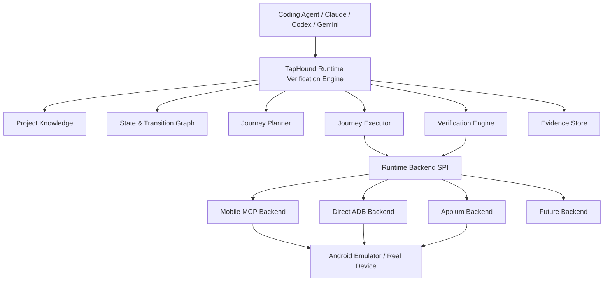
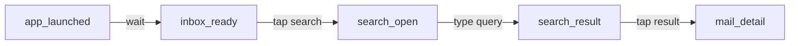
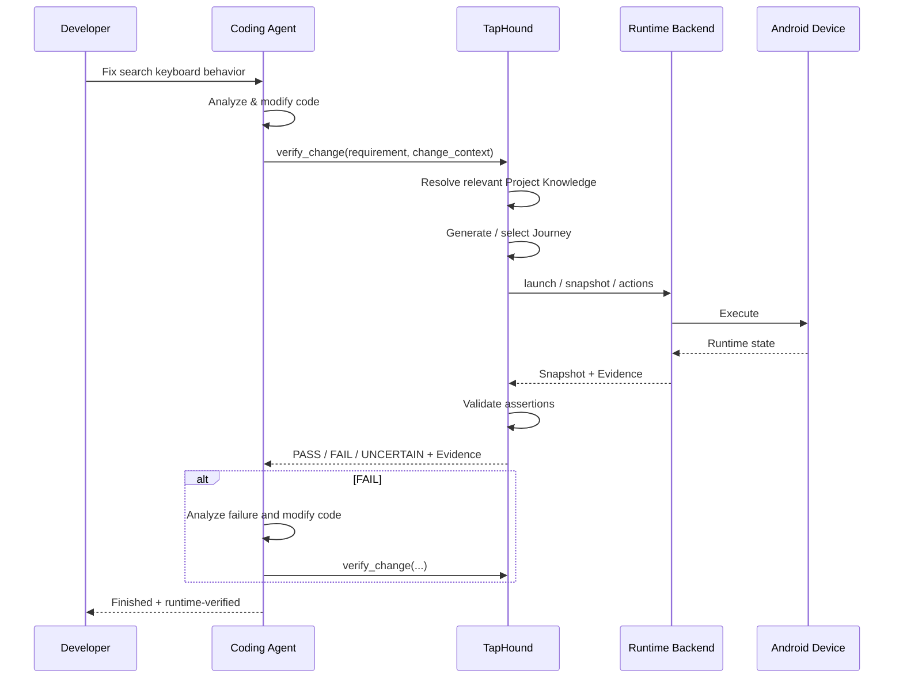

# TapHound V2：核心聚焦架构与第三方能力边界

> 状态：Architecture Direction / V2 Baseline  
> 日期：2026-09-08  
> 目标：重新定义 TapHound 的产品边界、核心资产与技术架构。对于设备控制、UI 读取、日志等通用能力，默认优先复用成熟开源实现；TapHound 集中投入 Project Knowledge、Journey、状态建模、运行时验证和 Evidence。

---

## 1. 结论

TapHound 不应继续发展成另一个 Android Automation Driver、ADB Wrapper 或 Mobile MCP Server。

新的核心定位：

> **TapHound is a runtime verification engine for AI-driven Android development.**
>
> TapHound 的目标不是让 AI “能够操作 Android App”，而是让 Coding Agent **能够证明一次 Android 代码修改在真实运行环境中正确工作**。

因此，从 V2 开始采用以下原则：

1. **Device Plumbing 默认复用第三方。**
   - device discovery
   - install / uninstall
   - launch / terminate
   - screenshot
   - accessibility / UI hierarchy
   - tap / swipe / type / key event
   - logcat / crash
   - screen recording
   - MCP transport

2. **TapHound 自研语义和验证层。**
   - Project Knowledge
   - Screen / Anchor semantic model
   - State / Transition Graph
   - Journey generation
   - Journey replay
   - Expected Outcome / Assertions
   - Runtime recovery
   - Evidence
   - PASS / FAIL / UNCERTAIN
   - Verified Journey lifecycle
   - stale detection
   - benchmark / regression

3. **TapHound 不绑定某一个 Driver。**
   Mobile MCP 可以成为第一优先 Runtime Backend，但不是 TapHound Domain Model 的组成部分。

4. **Runtime Ref != Semantic Anchor。**
   第三方 UI tree 中的 element id / `@ref` 只存在于单次 Runtime Snapshot；TapHound 持久化的是跨版本、有业务意义的 Semantic Anchor。

5. **缓存 Knowledge，不缓存 Plumbing。**
   TapHound 的 Cache 应围绕 Screen、Anchor、Transition、Verified Path 和历史 Evidence，而不是围绕 ADB session、device connection 或 raw hierarchy 做重复建设。

---

# 2. 为什么现在必须重新划边界

以 Mobile MCP 为代表的开源项目已经快速覆盖传统 Mobile Automation 的大量底层工作。

截至 2026-09-08，Mobile MCP 已公开提供：

- Android / iOS emulator、simulator、real device 支持
- device discovery
- app install / launch / terminate
- screenshot
- structured UI element listing
- coordinate click
- swipe / long press / typing / hardware button
- screen recording
- device logs / crash reports
- MCP interface
- LLM-driven multi-step user journey 场景

其 roadmap 还在推进：

- long-lived background daemon
- stable element `@ref`
- embedded Android Device Kit
- WebView support
- file system tools
- streamable HTTP

这说明 **底层设备自动化正在快速商品化 / 基础设施化**。

TapHound 如果继续把主要精力投入：

```text
ADB wrapper
UI dump
coordinate resolver
tap/swipe/type
install/launch
MCP tool exposure
connection cache
```

会面临三个问题：

- 与成熟开源项目重复开发；
- 维护成本长期高于差异化价值；
- 开源社区的迭代速度通常高于独立项目。

因此应该主动放弃低壁垒层，将架构向上移动。

---

# 3. 新的产品问题定义

传统 Mobile Automation 解决：

> **How can an agent operate the app?**

TapHound V2 解决：

> **How can a coding agent know that its Android change actually works?**

例如用户向 Coding Agent 提出：

```text
修改邮件搜索页：
搜索结果返回后，如果搜索框仍有焦点，应自动收起键盘。
```

代码生成本身并不是任务终点。

真正完整的开发闭环应该是：

```text
Requirement
    ↓
Code Change
    ↓
Build / Install
    ↓
Understand Runtime State
    ↓
Reach Required App State
    ↓
Perform User Journey
    ↓
Observe Result
    ↓
Validate Expected Outcome
    ↓
Collect Evidence
    ↓
PASS / FAIL / UNCERTAIN
```

TapHound 的价值集中在后半段。

---

# 4. TapHound 与 Runtime Driver 的职责边界

## 4.1 Runtime Driver 负责“发生什么”

Runtime Driver 应回答：

```text
有哪些设备？
当前 App 是什么？
屏幕上有什么元素？
给我截图。
点击这个位置 / element。
输入这些文字。
按返回键。
获取日志。
```

这类接口尽量标准化，不包含业务语义。

---

## 4.2 TapHound 负责“这意味着什么”

TapHound 应回答：

```text
当前属于哪个 Screen？
这个 UI element 是否对应 compose.send_button？
当前是否已经满足 compose_ready 状态？
从 inbox 到 compose_ready 哪条路径最可靠？
这次代码修改影响哪些 Journey？
这个 Journey 的预期结果是什么？
运行结果能否证明需求已经实现？
失败属于产品 Bug、环境异常，还是判断证据不足？
历史 Verified Journey 是否因 UI 变化而 stale？
```

这是 TapHound 的 Domain。

---

# 5. 总体架构



关键要求：

> **Project Knowledge、Journey 和 Verification 层不能感知 Mobile MCP tool name、ADB command 或 Appium locator。**

外部实现细节只能出现在 Runtime Adapter 内。

---

# 6. Runtime Backend SPI

建议将现有 `UiSnapshotProvider` 提升为更完整的 Runtime 抽象，而不是只抽象 UI hierarchy。

```kotlin
interface RuntimeBackend {
    val capabilities: RuntimeCapabilities

    suspend fun listDevices(): List<DeviceInfo>

    suspend fun appState(device: DeviceId): AppRuntimeState

    suspend fun launchApp(
        device: DeviceId,
        packageName: String,
        options: LaunchOptions = LaunchOptions()
    )

    suspend fun terminateApp(
        device: DeviceId,
        packageName: String
    )

    suspend fun snapshot(
        device: DeviceId
    ): RuntimeSnapshot

    suspend fun execute(
        device: DeviceId,
        action: RuntimeAction
    ): ActionResult

    suspend fun logs(
        device: DeviceId,
        request: LogRequest
    ): LogResult

    suspend fun captureEvidence(
        device: DeviceId,
        request: EvidenceRequest
    ): RuntimeEvidence
}
```

具体 Backend：

```text
RuntimeBackend
├── MobileMcpRuntimeBackend
├── AdbRuntimeBackend
├── AppiumRuntimeBackend
└── FakeRuntimeBackend        # benchmark / unit test
```

---

# 7. Capability Model

不同开源实现的能力一定不一致，因此不要假定 Runtime Backend 功能完全相同。

建议显式声明：

```kotlin
data class RuntimeCapabilities(
    val accessibilityTree: Boolean,
    val stableRuntimeElementRef: Boolean,
    val screenshot: Boolean,
    val screenRecording: Boolean,
    val logs: Boolean,
    val crashReport: Boolean,
    val webViewInspection: Boolean,
    val deepLink: Boolean,
    val fileTransfer: Boolean,
)
```

Journey Planner / Verification Engine 根据 capabilities 动态选择策略。

例如：

```text
Accessibility tree 可用
        ↓
优先 semantic matching

Accessibility tree 不完整
        ↓
screenshot fallback

stable ref 可用
        ↓
本次 snapshot 内优先 ref action

stable ref 不可用
        ↓
bounds / coordinate fallback
```

注意：

> Capability 是 Runtime 能力，不是 Project Knowledge。

---

# 8. 最重要的模型边界：Runtime Element vs Anchor

这是后续架构最需要守住的一条线。

## Runtime Element

第三方 Driver 返回：

```yaml
runtime_element:
  ref: "@ref32"
  text: "Send"
  resource_id: "com.example:id/send"
  bounds: [880, 110, 1040, 270]
  clickable: true
```

它表达：

> 当前这一帧 UI 中有这么一个节点。

它可能下一帧、下一次启动甚至下一版本就不存在。

---

## Semantic Anchor

TapHound 保存：

```yaml
anchor:
  id: compose.send_button
  screen: compose_mail
  role: primary_action
  semantics:
    action: send_mail

  locators:
    - resource_id: com.example:id/send
      confidence: 1.0

    - content_description: Send
      confidence: 0.9

    - text: Send
      confidence: 0.7
```

它表达：

> “发送邮件”这个产品语义对象。

所以：

```text
Runtime @ref
      ↓ resolve
Semantic Anchor
```

而不是：

```text
Semantic Anchor = @ref32
```

绝不能将第三方 runtime ref 持久化成为项目 Knowledge。

---

# 9. Project Knowledge：TapHound 的第一核心资产

TapHound 应逐渐形成一个专门服务于 Runtime Verification 的轻量 Project Model。

不追求理解整个 Android 项目，而是理解“执行任务需要的部分”。

建议模型：

```text
Project
├── Screens
│   ├── Anchors
│   ├── Fingerprints
│   └── Preconditions
│
├── States
│
├── Transitions
│
├── Journeys
│
├── Assertions
│
└── Evidence History
```

---

# 10. Screen

Screen 不应单纯等于 Activity / Fragment / Compose Route。

一个 Screen 是 **Runtime 可辨识的交互状态空间**。

例如：

```yaml
screen:
  id: mail_search

  fingerprints:
    required:
      - anchor: search.input
      - anchor: search.result_list

    optional:
      - anchor: search.clear_button

  confidence_threshold: 0.85
```

同一个 Activity 中可以有多个 Screen：

```text
MailActivity

├── mail_list
├── mail_search_empty
├── mail_search_loading
├── mail_search_result
└── mail_search_no_result
```

这对于验证比 Android framework hierarchy 更有价值。

---

# 11. State

Screen 还不足以表达完整上下文，因此增加 State。

```yaml
state:
  id: search_result_keyboard_visible

  screen: mail_search_result

  conditions:
    - keyboard.visible == true
    - search.input.focused == true
    - search.result_list.visible == true
```

状态可以包含：

- UI state
- App state
- login state
- keyboard state
- network state
- persisted data state

但第一阶段不要做无限复杂的状态建模。

原则：

> 只建模 Journey 和 Verification 真正需要的状态。

---

# 12. Transition Graph

已验证的 App 操作逐渐形成有向图：



Transition：

```yaml
transition:
  id: inbox.open_search

  from: inbox_ready
  to: search_open

  action:
    tap: inbox.search_button

  postconditions:
    - screen == mail_search
    - anchor search.input visible
```

Transition 与普通 UI action 的区别：

> 一个 Transition 必须包含目标状态和成功判断。

---

# 13. Journey

Journey 是 TapHound 的第二核心资产。

它不是简单录制脚本。

```yaml
journey:
  id: mail.search.keyboard_should_hide

  intent:
    "Search mail and verify keyboard hides when results appear"

  start_state:
    inbox_ready

  steps:
    - transition: inbox.open_search

    - action:
        type:
          anchor: search.input
          text: "invoice"

    - wait:
        state: search_result

  expected:
    - keyboard.visible == false
    - anchor: search.result_list
      visible: true
```

Journey 至少包含：

```text
Intent
Start State
Steps
Expected Outcome
Evidence Policy
```

而不仅仅是：

```text
tap → type → tap
```

---

# 14. Candidate Journey 与 Verified Journey

建议 Journey 有明确生命周期：

```text
Generated
   ↓
Candidate
   ↓ runtime execute
Observed
   ↓ validate
Verified
   ↓ app changes
Possibly Stale
   ↓ replay
Verified / Stale
```

状态：

```text
CANDIDATE
VERIFIED
STALE
BROKEN
DISABLED
```

只有成功 replay 并通过 validation 的 Journey 才能成为 `VERIFIED`。

这能够解决 AI Journey 最大的问题：

> LLM 生成“看起来合理”的步骤，不等于步骤真的能执行。

---

# 15. Verification Engine：TapHound 的核心壁垒

Journey 执行完成后不能让 LLM 单纯说：

> “Looks good.”

需要结构化判断。

建议输出：

```yaml
verification:
  result: PASS

  assertions:
    - id: keyboard_hidden
      result: PASS
      observed: false
      expected: false

    - id: search_results_visible
      result: PASS
      confidence: 0.98

  evidence:
    - screenshot_after_search.png
    - ui_snapshot_after_search.json
    - logcat_slice.txt
```

结果类型建议不是只有 Boolean：

```text
PASS
FAIL
UNCERTAIN
ERROR
```

其中：

### PASS
证据能够支持预期结果。

### FAIL
证据明确反驳预期结果。

### UNCERTAIN
Runtime 正常，但当前证据不足以确定结果。

### ERROR
Journey 本身没有完成，例如：

- device disconnected
- app crash
- timeout
- backend error

这样可以避免将测试基础设施问题误报为产品 Bug。

---

# 16. Evidence First

TapHound 的 Verification 应坚持：

> **No PASS without evidence.**

Evidence 可包括：

```text
UI Snapshot
Screenshot
Screen Recording
Logcat slice
Crash report
App state
Matched Screen
Matched Anchors
Observed transitions
Timing data
```

例如：

```text
Assertion:
keyboard.hidden == true

Evidence:
IME visible = false
search.input.focused = false
screenshot = xxx.png
```

Evidence 也是后续 Debug Agent 的输入。

---

# 17. Runtime Recovery

传统脚本：

```text
step 3 fail
→ test fail
```

TapHound 应允许有限度恢复：

```text
Expected state: inbox_ready
Observed state: mail_detail

Known graph:
mail_detail --back--> inbox_ready

Recovery:
press BACK
verify inbox_ready
continue Journey
```

但 Recovery 需要严格约束。

建议分为：

```text
SAFE_RECOVERY
CONDITIONAL_RECOVERY
NO_RECOVERY
```

第一阶段只实现低风险 deterministic recovery：

- dismiss keyboard
- dismiss known dialog
- BACK to known parent screen
- relaunch app
- wait for known loading transition

暂时不要允许 LLM 任意探索后声明“恢复成功”。

---

# 18. UI Cache 应改名为 Knowledge Cache

之前设计 UI Cache 的想法仍然成立，但应明确缓存对象。

不要重点缓存：

```text
adb connection
raw hierarchy
runtime element ref
coordinate
```

应缓存：

```text
Screen fingerprints
Anchor locator history
Transition reliability
Verified Journey
Known recovery path
State match history
Assertion evidence pattern
```

示例：

```yaml
anchor_resolution_history:
  anchor: compose.send_button

  matches:
    - locator: resource_id=com.foo:id/send
      success: 124
      failure: 1
      last_seen_version: 5.8.0
```

这才会随着 TapHound 使用时间增加形成长期资产。

---

# 19. 第三方能力采用策略

## Level A：默认复用

除非有非常明确的技术原因，不自行开发：

```text
device discovery
ADB connection lifecycle
install/uninstall
app launch / terminate
basic gestures
text input
hardware key events
screen capture
screen recording
raw accessibility dump
raw device logs
crash report retrieval
MCP transport
```

Mobile MCP 可以优先承担这些能力。

---

## Level B：Adapter 封装后复用

这些能力可以使用第三方，但 TapHound 必须拥有自己的抽象：

```text
UI snapshot
runtime element ref
element interaction
WebView inspection
log collection
evidence capture
```

原因是它们直接被 Verification 使用。

---

## Level C：TapHound 自研

```text
Screen recognition
Semantic Anchor
Anchor resolution strategy
Project Knowledge
State model
Transition graph
Journey generation
Journey lifecycle
Journey replay
Recovery policy
Assertion DSL
Verification Engine
Evidence correlation
PASS / FAIL / UNCERTAIN
Stale detection
Benchmark
```

这些构成项目长期价值。

---

# 20. Mobile MCP 的定位

建议：

> **Mobile MCP = preferred Runtime Backend, not core dependency.**

即：

```text
TapHound
   ↓
RuntimeBackend SPI
   ↓
MobileMcpRuntimeBackend
   ↓
Mobile MCP
```

而不是：

```text
TapHound
   ↓
Mobile MCP concepts everywhere
```

这样做有几个好处：

1. Mobile MCP 更新快时可以直接收益；
2. Mobile MCP 某次 breaking change 只影响 Adapter；
3. 某些场景可以切回 Direct ADB；
4. 后续可以接 Appium / Maestro / 自研 driver；
5. benchmark 可以用 FakeRuntimeBackend 跑纯逻辑测试。

---

# 21. 是否保留 Direct ADB Backend

建议：**保留，但降级为兼容 / fallback backend。**

原因：

- Android-only 的部分能力通过 ADB 很简单；
- 可以作为 Mobile MCP 故障时的 fallback；
- benchmark 和定位底层问题时有价值；
- 避免项目对单一第三方形成硬依赖。

但是不要继续扩展成完整 Automation Framework。

Direct ADB backend 的目标是：

> **minimum viable fallback**

而不是：

> **feature parity with Mobile MCP**

---

# 22. MCP 应该放在哪里

TapHound 仍然可以提供自己的 MCP，但是 MCP 应当暴露 **TapHound 语义能力**，而不是重复 Mobile MCP。

不要主要提供：

```text
mobile_tap
mobile_swipe
mobile_type
mobile_screenshot
```

Mobile MCP 已经非常适合做这些。

TapHound MCP 应更像：

```text
taphound_understand_current_state

taphound_generate_journey

taphound_execute_journey

taphound_verify_change

taphound_find_path

taphound_explain_failure

taphound_get_evidence

taphound_refresh_project_knowledge
```

这样 Coding Agent 可以同时挂载：

```text
Mobile MCP
TapHound MCP
```

或者 TapHound 内部直接使用 Mobile MCP Backend。

---

# 23. 推荐的 Coding Agent Workflow

最终希望支持：



最终用户体验不是：

```text
AI 写完代码
“应该没问题”
```

而是：

```text
AI 写完代码
TapHound replayed #mail.search.keyboard_should_hide
PASS
Evidence: screenshot + snapshot
```

---

# 24. 与现有 TapHound 设计的调整

## 保留并加强

### `UiSnapshotProvider`

保留思想，但升级为 RuntimeBackend / SnapshotProvider 体系。

### Anchor

继续作为核心模型，但明确它是 **Semantic Anchor**。

### Project Context

不再追求“大而全 Project Context”。

改成：

> **Verification-oriented Project Knowledge**

### Journey

继续重点投入，并增加：

- Candidate / Verified lifecycle
- Expected Outcome
- Evidence policy
- replay
- stale handling

### Benchmark YAML

继续推进，并成为架构演进最重要的 Ground Truth。

---

## 降低优先级

```text
ADB orchestration
raw UI dump implementation
low-level action APIs
MCP device tools
coordinate interaction
connection caching
```

---

## 暂停

如果当前存在下列独立开发计划，建议暂停：

```text
重新实现完整 Appium UiAutomator2 等价层
完整自研 MCP mobile-driver
复杂 Device Manager
重复造 Android accessibility agent
跨 Android/iOS driver abstraction 的过度设计
```

TapHound 现阶段仍然应 **Android-first**。

底层 Driver 支持 iOS 并不意味着 TapHound 现在需要立即扩展 iOS Knowledge / Verification Model。

---

# 25. 新的模块建议

```text
taphound/

├── domain/
│   ├── project/
│   ├── screen/
│   ├── anchor/
│   ├── state/
│   ├── transition/
│   ├── journey/
│   ├── assertion/
│   └── evidence/
│
├── knowledge/
│   ├── discovery/
│   ├── resolver/
│   ├── cache/
│   └── stale/
│
├── planner/
│   ├── journey/
│   ├── path/
│   └── recovery/
│
├── verification/
│   ├── executor/
│   ├── assertion/
│   ├── matcher/
│   ├── evidence/
│   └── result/
│
├── runtime/
│   ├── api/
│   ├── mobilemcp/
│   ├── adb/
│   └── fake/
│
├── benchmark/
│
└── interface/
    ├── cli/
    └── mcp/
```

注意依赖方向：

```text
Domain
  ↑
Knowledge / Planner / Verification
  ↑
Runtime SPI
  ↑
Runtime implementations
```

Domain 层禁止依赖：

```text
ADB
Mobile MCP
Appium
UIAutomator
MCP SDK
```

---

# 26. V2 优先级重新排序

## P0：先证明 TapHound 的核心价值

### P0.1 Runtime Backend SPI

目标：

```text
上层完全摆脱 adb / Mobile MCP 实现细节
```

只覆盖目前 Benchmark 真正需要的能力。

---

### P0.2 Screen Recognition

输入：

```text
RuntimeSnapshot
```

输出：

```text
MatchedScreen
confidence
matched anchors
missing anchors
```

---

### P0.3 Semantic Anchor Resolution

目标：

```text
Semantic Anchor
      ↓
Runtime Element
```

支持多 locator + confidence。

---

### P0.4 Journey v2

加入：

```text
start state
expected state
assertion
evidence
lifecycle
```

---

### P0.5 Deterministic Replay

同一个 Journey 可以：

```text
run
reset
replay
compare
```

---

### P0.6 Verification Result

固定输出：

```text
PASS
FAIL
UNCERTAIN
ERROR
```

并且所有结果带 Evidence。

---

# 27. P1：建立 Knowledge Flywheel

完成 P0 后再做：

### Transition Graph

记录成功执行路径。

### Journey Reuse

新任务优先复用历史 Journey / Sub-Journey。

### Anchor History

记录 locator 稳定程度。

### Stale Detection

App 版本升级后判断：

```text
Screen changed
Anchor missing
Transition reliability dropped
Journey replay failed
```

### Recovery

只做 deterministic recovery。

---

# 28. P2：Agent Intelligence

P0/P1 稳定后再做：

```text
LLM Journey Planner
Automatic Knowledge Discovery
Failure diagnosis
Change impact → Journey selection
Knowledge refinement
Cross-task optimization
```

重要原则：

> **LLM Intelligence 必须建立在 deterministic runtime primitives 上。**

否则项目很容易重新变成 Prompt Engineering。

---

# 29. Benchmark 重新定义

之前规划的 20 个 Benchmark 非常重要。

它们不只是功能测试，而应该成为：

> **TapHound Architecture Ground Truth**

每个 Benchmark 建议包含：

```yaml
id: search_keyboard_hide

description: >
  Search result should dismiss keyboard after results arrive.

initial_state:
  screen: inbox

intent:
  Search mail for invoice

expected:
  - screen: mail_search_result
  - keyboard.visible: false

allowed_recovery:
  - dismiss_dialog
  - back_to_inbox

metrics:
  - journey_success
  - assertion_accuracy
  - recovery_count
  - runtime_actions
  - elapsed_time
```

需要重点统计的不只是：

```text
任务最终有没有完成
```

还包括：

```text
Screen recognition accuracy
Anchor resolution accuracy
Journey generation success
Replay success
False PASS rate
False FAIL rate
UNCERTAIN rate
Recovery rate
Action count
```

其中最重要指标应该是：

> **False PASS 接近 0。**

对于验证工具，“不知道”优于错误宣布 PASS。

---

# 30. 第三方依赖治理

复用第三方不代表无条件耦合。

需要建立简单 Dependency Policy。

## 30.1 Adapter Boundary

所有第三方必须通过 Runtime SPI。

## 30.2 Capability Probe

启动时探测功能，不硬编码版本能力。

## 30.3 Contract Test

Runtime Backend 必须通过统一测试：

```text
snapshot contract
action contract
launch contract
error contract
evidence contract
```

## 30.4 Version Pinning

CI / Benchmark 使用明确版本，不直接追 `latest`。

开发环境可提供：

```text
stable
latest
```

两个 channel。

## 30.5 Fallback

核心 Android 流程保留 minimum Direct ADB fallback。

## 30.6 No Persisted Vendor IDs

禁止将以下信息存入 Knowledge：

```text
Mobile MCP @ref
Appium session id
ADB transient process id
raw coordinate as primary identity
```

---

# 31. 不应该再做什么

后续 Review 新需求时，如果功能属于以下类型，应默认拒绝进入 TapHound Core：

```text
“我们自己做一个更快的 adb wrapper”

“我们把所有 Appium action 都重新实现一遍”

“给 MCP 再增加几十个 tap / swipe 的工具”

“自己维护所有 Android/iOS device communication”

“把 UIAutomation 的每一种 edge case 都自己兼容”
```

除非：

1. 现有第三方无法满足 Benchmark；
2. 且这个缺陷会直接影响 TapHound Verification 的准确性；
3. 且 Adapter / fallback 无法解决。

否则不投入。

---

# 32. TapHound 的真正护城河

随着 Coding Agent 能力增强，代码生成会越来越商品化。

同时 Mobile MCP / Appium / Maestro 等会让设备控制越来越商品化。

中间仍然缺少的是：

```text
Code
  ↓
Runtime Intent
  ↓
Known App State
  ↓
Reliable Journey
  ↓
Observed State
  ↓
Verification
```

因此 TapHound 的长期资产不是 driver code，而是：

### 1. App Semantic Knowledge

```text
Screen
Anchor
State
Transition
```

### 2. Verified Journey Corpus

```text
哪些路径真的在这个 App 上成功过
```

### 3. Verification Knowledge

```text
什么证据足以证明一个需求完成
```

### 4. Runtime History

```text
哪些 Anchor 稳定
哪些 Journey 经常 stale
哪些恢复策略可靠
```

使用越久，这些资产越有价值。

第三方 Driver 的更新不会削弱这个价值，反而会让 TapHound 获得更强 Runtime 基础设施。

---

# 33. 一句话判断一个功能是否属于 TapHound

以后每增加一个 Feature，可以先问：

> **如果 Mobile MCP / Appium 明天把这个能力做到完美，TapHound 是否仍然需要自己拥有它？**

如果答案是“否”，优先放 Runtime Adapter。

如果答案是“是”，它才可能属于 TapHound Core。

例如：

| Feature | Core? |
|---|---:|
| tap element | No |
| screenshot | No |
| UI dump | No |
| logcat | No |
| app launch | No |
| Semantic Anchor | Yes |
| Screen Recognition | Yes |
| Transition Graph | Yes |
| Journey Replay | Yes |
| Assertion | Yes |
| Evidence Correlation | Yes |
| PASS / FAIL / UNCERTAIN | Yes |
| Stale Detection | Yes |
| Recovery Policy | Yes |

---

# 34. 接下来建议的实际开发顺序

不要一次性大重构。

建议按照下面顺序迁移：

## Step 1 — 固化当前 Benchmark

先把 20 个核心场景作为回归基线。

不要继续通过单一真实需求打补丁。

---

## Step 2 — 建立 RuntimeBackend SPI

将现有 ADB / UIAutomator 调用逐渐移动到 Adapter。

这一阶段保持当前功能行为基本不变。

---

## Step 3 — 接入 Mobile MCP Backend PoC

只验证几个核心 capability：

```text
list device
launch app
snapshot
screenshot
tap
type
back
logs
```

目标不是全面接入，而是证明 RuntimeBackend abstraction 正确。

---

## Step 4 — 完成 Screen + Anchor 基础模型

让 Benchmark 不再直接依赖 selector / coordinate。

---

## Step 5 — Journey v2

加入：

```text
start state
expected outcome
assertions
evidence
status
```

---

## Step 6 — Replay + Verification

这是第一版真正有产品意义的里程碑。

Definition of Done：

> 给一个需求和一个已安装 APK，TapHound 能选择/生成 Journey，在真实 Android Runtime 中执行，并返回结构化 PASS / FAIL / UNCERTAIN + Evidence。

---

## Step 7 — Knowledge Flywheel

再开始做：

```text
transition reuse
journey reuse
history
stale
recovery
```

---

# 35. 第一阶段明确不做

V2 第一阶段刻意不做：

```text
iOS product support
cloud device farm
visual AI-first automation
复杂 computer vision
完整 Appium replacement
完整 Mobile MCP replacement
跨设备并发 orchestration
大规模 test management platform
录制器 UI
Web Dashboard
```

这些都可能有价值，但不是当前 TapHound 最需要证明的事情。

---

# 36. V2 第一里程碑

建议定义：

## TapHound V2 M1 — Runtime Verified Journey

输入：

```text
Requirement
APK / runnable project
Known project knowledge
```

处理：

```text
select/generate journey
→ reach start state
→ execute
→ observe
→ assert
→ collect evidence
```

输出：

```yaml
result: PASS

journey: mail.search.keyboard_should_hide

runtime_backend: mobile-mcp

assertions:
  - keyboard_hidden: PASS
  - result_visible: PASS

evidence:
  - before.png
  - after.png
  - final_snapshot.json
```

当这个流程在 20 个 Benchmark 上稳定成立时，再继续扩展智能程度。

---

# 37. 项目定位最终版本

不推荐：

> AI-powered Android UI automation framework

因为太容易与：

- Mobile MCP
- Appium
- Maestro
- UIAutomator

混在一起。

建议内部先统一为：

> **TapHound — Runtime Verification for AI-driven Android Development**

简短解释：

> **Mobile automation tools help AI operate an app. TapHound helps AI prove its code change works.**

中文：

> Mobile Automation 解决 AI 怎么操作 App；TapHound 解决 AI 怎么证明自己把 App 改对了。

---

# 38. Architecture Decision Summary

```yaml
architecture_decisions:

  product_focus:
    decision: runtime_verification

  platform:
    decision: android_first

  device_plumbing:
    decision: third_party_first

  primary_runtime_candidate:
    decision: mobile_mcp

  vendor_lock_in:
    decision: forbidden_in_domain

  direct_adb:
    decision: minimum_fallback

  runtime_ref:
    decision: transient_only

  semantic_anchor:
    decision: core_persistent_model

  cache:
    decision: knowledge_cache

  journey:
    decision: core_asset

  verification:
    decision: core_asset

  false_pass:
    decision: highest_priority_risk

  ios:
    decision: out_of_scope_for_v2_m1
```

---

# 39. Reference

Mobile MCP repository:  
https://github.com/mobile-next/mobile-mcp

Mobile MCP Roadmap:  
https://github.com/mobile-next/mobile-mcp/blob/main/ROADMAP.md

Snapshot date: 2026-09-08.

---

# 40. 最终原则

TapHound V2 后续的架构决策应始终遵循：

> **Outsource mechanics. Own semantics. Verify outcomes.**

即：

```text
通用执行能力 → 借助开源生态

App 语义知识 → TapHound

Journey 与状态关系 → TapHound

运行结果判断 → TapHound

证据与可信度 → TapHound
```

这能够让 TapHound 的开发资源集中在最难被通用 Mobile Automation 项目取代的部分，同时随着 Mobile MCP 等开源基础设施变强而同步受益，而不是与它们竞争。
