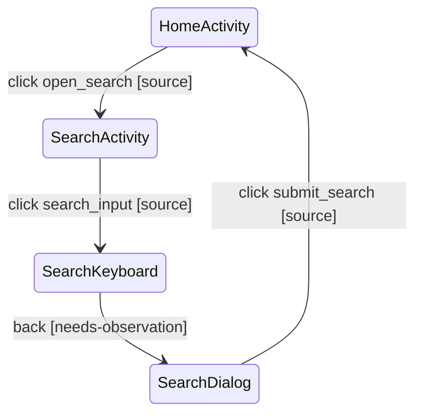

# Goal

Open Search, submit an empty query, and verify validation.

## Preconditions

- Start from an independent cold launch.
- Use the approved `search-basic` fixture.

## Expected Journey

1. Open Search from Home.
2. Leave the query empty.
3. Submit the query.
4. Observe the empty-query validation state.

## State Transition Map

| edge | action | from | to | confidence | locator hint |
|------|--------|------|----|-----------|--------------|
| e1 | click | HomeActivity | SearchActivity | source | resourceId: open_search |
| e2 | click | SearchActivity+Keyboard | SearchActivity+Keyboard | source | resourceId: search_input |
| e3 | back | SearchActivity+Keyboard | SearchActivity+Dialog | needs-observation | — |
| e4 | click | SearchActivity+Dialog | HomeActivity | source | text: Save draft; logcat expect tag=IM.SendMailActivity |

Overlay sub-states of the same Activity (keyboard/dialog/drawer) use distinct
node names (`Activity+Suffix`).

## Capability Notes

- Runtime variable capture: not supported — use a fixed unique string as the
  business identifier.
- Multi-field locators: stop at the first field with a unique match; later
  fields are not validated — text assertions must use a text-only locator.
- logcat expect: tag matches by exact equality (including all prefixes);
  literal matches by substring.

## Assertions

- `SearchActivity` remains foreground.
- The `empty_query_error` element is visible.

## Implementation Hints

- Home entry resource ID: `open_search`.
- Submit resource ID: `submit_search`.
- Relevant module: `:feature:search`.

## Constraints

- Do not use coordinates or visual guessing.
- Final Replay must pass.
- Idempotency: repeat runs create duplicates; draft list uses index: 0.

## Evidence References

- `feature/search/src/main/java/com/example/search/SearchScreen.kt`
- `feature/search/src/main/res/layout/search_screen.xml`
