# Goal

<one-sentence test scenario from caseGoal>

## Preconditions

- <start state, e.g. "Start from an independent cold launch.">
- <fixture or data requirement if applicable>

## Expected Journey

1. <step derived from State Transition Map edge e1>
2. <step derived from State Transition Map edge e2>
3. <step derived from State Transition Map edge e3>

## State Transition Map

```mermaid
stateDiagram-v2
    <FromActivity> --> <ToActivity>: <action> <locator-hint> [source|needs-observation]
    <FromActivity> --> <ToActivity>+<Overlay>: <action> <locator-hint> [source|needs-observation]
```

| edge | action | from | to | confidence | locator hint |
|------|--------|------|----|-----------|--------------|
| e1 | <action> | <from> | <to> | source | resourceId: <name> |
| e2 | <action> | <from> | <to> | needs-observation | text: <label> |

> Overlay sub-states of the same Activity (keyboard/dialog/drawer) use
> distinct node names (`Activity+Suffix`).

## Capability Notes

- Runtime variable capture: <supported/not supported — guidance, e.g. "not supported — use a fixed unique string as the business identifier.">
- Multi-field locators: TapHound stops at the first field with a unique match; later fields are not validated — text assertions must use a text-only locator.
- logcat expect: tag matches by exact equality (including all prefixes); literal matches by substring.

## Assertions

- <assertion, e.g. "<Activity> remains foreground.">
- <assertion, e.g. "The <error_element> element is visible.">

## Implementation Hints

- <resource ID hint, e.g. "Home entry resource ID: open_search.">
- <relevant module, e.g. "Relevant module: :feature:search.">

## Constraints

- Do not use coordinates or visual guessing.
- Final Replay must pass.
- <idempotency note if applicable, e.g. "Repeat runs create duplicate entries; list uses index: 0.">

## Evidence References

- <source file path, e.g. "feature/search/src/main/java/com/example/search/SearchScreen.kt">
- <layout file path, e.g. "feature/search/src/main/res/layout/search_screen.xml">
