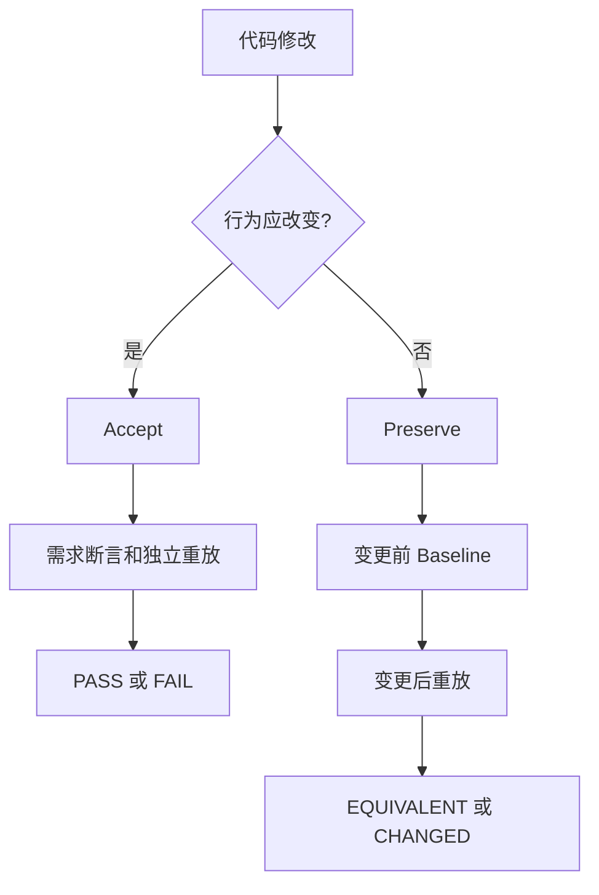

# Coding Agent 的 Android 自验证工作流

> **状态：历史设计文档。** 本文基于提交 `94167aa` 时的代码分析，用于记录设计动机。当前实现以
> [Workflow Skills](./workflow-skills.md) 为准：Accept 与 Preserve 已合并为
> `taphound-verify-change`，编码过程中的冒烟检查由 `taphound-flash` 负责。

> 本文档第 3 节的现状判断已对源码逐条核对（基线提交 `94167aa`），关键结论附代码位置。
> 实施拆解见 [自验证工作流实施计划](./plans/2026-09-14-coding-agent-self-verification-implementation.md)。

## 1. 核心目标

TapHound 面向 Coding Agent 提供 Android 变更后的确定性自验证。它要回答两类互补问题：

1. **行为应改变（Accept）**：实现是否满足本次需求定义的新行为。
2. **行为应保持（Preserve）**：重构或内部调整后，已有可观察行为是否保持不变。

这两类问题覆盖大多数 App 迭代：

- 新功能、缺陷修复和交互调整进入 **Accept**；
- 重构、依赖升级、性能实现替换和无意改变风险较高的维护进入 **Preserve**；
- 同一变更可以同时包含两类目标，但必须按 Case 分开判定，不能用“新行为通过”掩盖既有行为回归。

TapHound 的定位不是通用自动化测试框架。它不追求测试 DSL、任意断言、测试夹具、并行调度或全平台设备矩阵的完备性，而是为 Coding Agent 提供一个小而可信的完成条件：

- **Accept** 以 Acceptance Contract Verdict `pass` 为成功；
- **Preserve** 以 Regression Comparator 的 `equivalent: true` 为成功；
- 确定性失败不能被 AI、语义评审或人工意见改写为成功。



这里的 `PASS` 对应 Contract Verdict `pass`，`FAIL` 是工作流层对 `fail`、`inconclusive`、`needsReview` 或 `invalid` 的非成功归纳；`EQUIVALENT` 对应 `equivalent: true`，`CHANGED` 对应 `equivalent: false`。协议中的原始状态名称保持不变。

## 2. 设计原则

1. **需求符合性与行为等价性分离**。同一次运行可以满足 Contract 但不等价于旧 Baseline，也可以等价于一个包含缺陷的 Baseline 却不满足 Contract。
2. **执行证据优先**。Project Context、Journey Brief 和生成会话帮助构造验证资产，但不能替代最终 Replay。
3. **失败关闭**。绑定漂移、证据缺失、验证策略不可复现或基础条件不可比较时，不输出成功。
4. **资产可追溯**。Journey、Contract、Baseline、Project Context、Knowledge 和运行报告都通过内容哈希或明确来源建立证据链。
5. **Core 保持确定性，Workflow 负责编排**。自然语言需求分析、编码、构建安装、多 Case 调度和结果汇总属于外部 Workflow Skill；TapHound Core 负责状态绑定、风险策略、设备执行、重放和证据发布。
6. **UI 与运行事件互补**。页面符合预期只证明可观察 UI 状态，关键异步操作还应以受 correlation key（主）和观察窗口（辅）约束的 Logcat 事件证明请求结果；日志成功也不能替代必要的 UI 结果检查。

## 3. 当前架构与缺口

### 3.1 Project Context

**已完成**

- Project Context Bundle 由根索引和每个 Gradle 模块的 shard 组成。
- `ProjectDescriber`、`ContextLoader`、`ContextValidator` 和 `ContextRefresher` 提供项目身份、模块选择、依赖展开、证据哈希与漂移检查。
- `generation start` 将解析后的 Context 选择绑定到生成会话；语义、文件清单或证据漂移会失败关闭。
- `taphound-journey-brief-author` 可基于只读项目证据和 `taphound observe` 为每个 Case 生成 Journey Brief。

**缺口**

- Project Context 描述“项目是什么”，不表达一次任务究竟要求行为改变还是保持。
- Context 漂移不能直接区分实现代码变化与验证资产变化，也不能证明新需求已经满足。

### 3.2 Journey 生成

**已完成**

- `generation start → observe/next/step → finalize` 是 revisioned、evidence-backed 的生成状态机。
- 每个 proposal 绑定当前 revision 和 Runtime Snapshot；Core 在执行前重查新鲜度并应用风险确认。
- `generation finalize` 重置 App，完整 Replay 候选 Journey，只有精确验证通过后才发布 Journey、meta、报告、receipt 和 manifest。
- External Flow、Anchor、Locator、Activity 和显式 `expect` 均由 Core 确定性执行。

**缺口**

- 当前 finalize 的 Replay 虽然会 force-stop 并冷启动 App，但仍属于同一 generation finalization 流程。它不是一个在进程、RuntimeSession、输入和可见状态上明确隔离的最终验证阶段。
- 生成过程已经观察过页面并积累 candidate state。工作流还需要证明最终验证不读取 proposal、生成期 snapshot 或可变工作目录中的隐式信息。
- **真正缺的不是“再跑一次”，而是可复现的验证身份。** finalize 调用 `VerifyRuntime` 时显式传入
  `requireFocusedInput: true` 与 `generatedReplayPolicy: true`
  （`src/application/generation/generation-finalizer.ts:399-400`），`StepRunner` 在该策略下改用前台绑定的
  layout 捕获、进程 PID 存活检查和 live container 能力要求
  （`src/application/runtime/step-runner.ts:417`、`446`、`495`、`1002`）。同时
  `session.idlePolicy` 只在 finalize 内合成为 `{...config, idle: session.idlePolicy}`
  （同文件 `384-386`），**没有随 Journey 或 meta 发布**。
  因此生成期严格度目前是一次性的、不可被后续独立验证复现的。

### 3.3 VerifyRuntime

**已完成**

- `VerifyRuntime` 检查安装状态，启动 Logcat，force-stop 并冷启动 App，等待进程和 Activity 就绪，再通过 `StepRunner` 执行 Journey。
- Replay 在每步检查 Activity、确定性解析 Locator 或 Anchor、执行动作、等待稳定、计算显式 expectation，并在首个主要失败处停止。
- 最终 screenshot、UI hierarchy、Logcat 和结构化报告仍会收集；后处理错误不会覆盖主要失败。
- `verify --journey`、`verify --contract` 和 `verify --diff` 已提供机器可读入口。

**缺口**

- 没有“与生成会话隔离”这一可验证的运行身份或 receipt。
- 冷启动不等于清除所有业务数据。登录态、服务端数据、系统权限和外部 App 状态仍可能跨运行保留，需要由 Workflow 明确前置条件。
- **CLI 的 `verify` 比 finalize 的 Replay 更宽松。** `verify --journey`、`verify --contract`、
  `verify --diff` 都只传 `manualReplay`
  （`src/cli/commands/verify.ts:149,233`、`src/cli/diff-verification.ts:316`、
  `src/application/contract/contract-verifier.ts:267`），不传
  `generatedReplayPolicy` / `requireFocusedInput`，并且使用项目 `config.idle` 而不是生成期 idle 策略。
  所以“再跑一次独立 verify”在当前代码下是**降低**严格度，不是提高，必须先补齐策略持久化才能作为 Accept 的完成证据。

### 3.4 Acceptance Contract

**已完成**

- Contract 以哈希绑定 Journey，表达 goal、preconditions、最终 assertions 和 evidence requirements。
- `taphound verify --contract <path> --json` 运行完整验证并输出 `pass`、`fail`、`inconclusive`、`needsReview` 或 `invalid`。
- Activity、元素可见性、Knowledge Screen 和证据要求都可确定性判断。
- Verdict 写入 `verdict.json`，且遵守确定性验证高于后续评审的 Source-of-Truth 层级。

**缺口**

- Contract 当前主要检查 Journey 前置条件和 Journey 结束后的断言，不能直接在任意 step 执行命名 Checkpoint。
- 自验证 Workflow 尚未把“本次需求文本、Case、Contract、实现变更和最终独立 Replay”汇总为一个统一结果。

### 3.5 Checkpoint

**已完成**

- `CheckpointDefinitionSchema` 已定义命名行为期望，可指定 `stepIndex`，并检查 Activity、Screen、可见元素和缺失元素。
- Checkpoint 是确定性条件，不是截图，也不会自行触发 AI。

**缺口**

- Checkpoint 目前仅存在于领域模型和文档中，尚未接入 Journey 执行、VerifyRuntime、报告或 CLI。
- 因此当前无法在一次 Replay 的中间阶段产出 Checkpoint 结果，也无法将这些结果直接纳入 Contract Verdict 或 Baseline。

### 3.6 Baseline 与 Regression Comparator

**已完成**

- `taphound baseline capture` 可从一个 `passed` 的 V4 report 离线提取 Activity、元素和可选 Screen 事实。
- Baseline 绑定 `journeySha256`，可选绑定 `contractSha256`，并记录 package、run 和源报告路径。
- `taphound baseline compare` 纯函数式比较当前 report 与 Baseline；所有事实复现时才返回 `equivalent: true`。

**缺口**

compare 的实际门禁比“只校验 Journey 哈希”更弱，等价语义也有若干结构性漏洞：

- **门禁基本为空**。`BaselineService.compare` 计算
  `requested = input.journeySha256 ?? baseline.journeySha256`，再断言
  `requested === baseline.journeySha256`
  （`src/application/checkpoint/baseline-service.ts:60-79`）。不传 `--journey-sha256` 时这是恒真判断。
  compare 从不读取 `report.journey.sha256`、`report.status`、`report.project.packageName`，
  因此任意 Journey 的、甚至 `failed` 的报告都能与任意 Baseline 比较。
- **空 Baseline 恒等价**。`BaselineSchema` 的 `activities` / `elements` / `screens` 都没有 `min(1)`
  （`src/domain/checkpoint.ts:75-85`），事实集为空时 `equivalent: true` 无条件成立。
  这是整条 Preserve 路径最短的假成功路径。
- **`contractSha256` 只是记录字段**，capture 时可写入，compare 从不使用。
- **Screen 事实只比 id，不比 status**。comparator 只做 `currentScreens.has(fact.screen)`
  （`src/application/checkpoint/regression-comparator.ts:140-149`），`matched → ambiguous` 检测不到；
  并且 `report.screens[].status` 目前是 `z.literal("matched")`（`src/domain/report.ts:169-172`），
  Baseline schema 里的 `ambiguous` / `unresolved` 实际写不进去。
- **`absent` 事实几乎不可用**。element fact 只来自 step 的 locator，`kind` 由
  `locator.status === "failed"` 推导（`src/application/checkpoint/baseline-capturer.ts:48-71`），
  passed 报告不会产生 `absent` fact，所以“本应消失的元素又出现了”这类回归无法表达。
- **`matchedBy` / `evidenceSha256` 采集但不比较**，resourceId 命中降级为 annotated fallback 仍算等价；
  且 `evidenceSha256 = sha256(locator.message)` 是对人类可读消息取哈希，不是稳定证据。
- **locator key 会碰撞**。`locatorToKey` 在缺 `requested` 时生成 `{resourceId: "resourceId"}`
  之类占位键（同文件 `77-94`），不同元素会折叠成同一条事实。
- Screen 事实依赖两次运行具有一致的 Knowledge 检测能力；`report.screens` 只由 Contract hook 产生
  （`src/application/runtime/verify-runtime.ts:875-884`），普通 `verify` 报告恒为空，
  因此 `verify --contract` 与 `verify --journey` 混用一定产生缺失证据。
- Baseline 只能证明已冻结事实的等价，不代表所有用户可观察行为都等价。

### 3.7 Impact

**已完成**

- `taphound impact` 和 `verify --diff` 将 Git ChangeSet 映射为受影响模块、Feature、Screen、Anchor 和 P0/P1/P2 Journey 集合。
- ImpactSet 绑定 Context 和 Knowledge 哈希，适合在大型项目中选择最小验证集。

**缺口**

- Impact 解决“哪些 Journey 可能受影响”，不决定某个 Case 应走 Accept 还是 Preserve。
- 若 Journey、Contract 或 Baseline 与实现一起变化，仅靠文件影响关系无法判断资产变化是否合理。
- **`verify --diff` 不产出 Verdict。** `JourneyVerdict.status` 是 replay 运行状态加 exitCode，
  `overall` 是 `"passed" | "failed" | "error"`，全程不经过 `ContractVerdictSchema`
  （`src/cli/diff-verification.ts:42-62`）。它既不能作为 Accept 的成功证据（Accept 要求 Verdict `pass`），
  也不能作为 Preserve 的成功证据（Preserve 要求 `equivalent: true`），只能当选择器和冒烟层。
- **默认 scope 是 `p0,p1`**（同文件 `selectedScopes`），`p2` 需显式指定；
  Workflow manifest 必须记录本次实际使用的 scope，否则“最小验证集”的覆盖范围不可追溯。

### 3.8 证据报告与 Journey 生命周期

**已完成**

- V4 report 记录 run、step、layer、环境、Activity、Locator、expect、Screen、主要失败、次要错误和证据路径。
- `generation finalize` 产出状态为 `verified` 的 Journey 和 meta sidecar。
- `journey check` 检测 `verified`、`draft`、`suspect`、`stale` 和 `retired`；`journey promote` 在重查 bundle、report 和 Journey 哈希后将高价值 Journey 提升为 `promoted`。
- `journey retire` 提供显式、不可逆的退出路径。

**缺口**

- 生命周期证明 Journey 来自一次可信生成和 Replay，但 meta 未记录该 Replay 使用的策略
  （`replayPolicy`、idle 策略）与 `knowledgeHash`，因此后续任何一次重放都无法声明与生成期等价。
- 当前没有一个工作流级 manifest 同时记录实现 diff、验证资产 diff、Contract Verdict、Baseline compare 和 promotion 决策。

### 3.9 Logcat 断言、等待与动态值

**已完成**

- Journey step 已支持一个显式 `expect`，类型可以是 `activity`、`element` 或 `logcat`。
- `logcat` expect 使用精确 tag、可选精确 level，以及 literal 或 regex pattern 匹配。
- `ExpectationEvaluator` 在 `timeoutMs` 内轮询，仅匹配当前 step 的 `[T0, T1]` Logcat 窗口；超时以 `EXPECT_LOGCAT_FAILED` 失败。
- 每个 step 的 scoped Logcat、匹配行和最终 Logcat artifact 可进入 V4 report。
- `wait` action 可等待 Layout 稳定，或通过 `until.element` 等待一个 UI 元素出现。

**缺口**

- 每个 step 只能携带一个 `expect`，不能表达“API success 日志和 UI 结果都必须满足”的 `allOf` 条件。
- Contract 的 `evidenceRequirements.kind: "logcat"` 只检查 Logcat artifact 是否存在，不检查业务事件内容。
- 当前 Replay 不捕获运行时变量，不能从 regex capture group 提取服务端生成的 `id`，也不能把该值替换到后续 Locator、输入或断言中。
- Logcat expect 只观察一个 step 的窗口。请求跨 step 完成、loading 较长或日志延迟时，可能错过事件。
- 当前失败分类能把 `EXPECT_LOGCAT_FAILED` 归为 expect failure，但不能根据结构化请求结果区分 client 参数错误、网络/环境错误和 server 错误。
- Generation recovery 处理的是中断 action 或 verification ownership，不是“等待服务端修复后从业务断点恢复”的 Workflow pause/resume。
- **观察窗口用的是宿主接收时间，不是设备日志时间戳**。`LogcatCollector` 以
  `clock.now()` 标记 `receivedAt`（`src/application/collector/logcat-collector.ts:93`），
  不解析 threadtime 的设备时间。冷启动、缓冲刷写和背压都会让 `receivedAt` 相对事件真实时间漂移，
  所以时间窗口只能作为辅助条件，不能作为确定性主键。
- **匹配是“首条命中”，没有唯一性判定**。`ExpectationEvaluator` 用
  `linesBetween(...).find(...)`，重复或串线事件不会失败关闭。
- **PID 作用域不严格**。`lines()` 放过所有 `pid === undefined` 的行（解析失败即绕过作用域，
  同文件 `130-138`），且 THREADTIME 正则的 tag 用 `[^:]+`，无法容纳带冒号的 tag（同文件 `33`）。
- **缓冲无界**。`collected` 是进程内数组，长跑 Case 会持续增长；跨 step 等待技术上可行
  （全程日志已在内存），但需要上限或落盘策略。

## 4. 双工作流方案

### 4.1 Accept：验证“行为应改变”

适用于新功能、缺陷修复和有意的行为调整。

```text
需求/Case
  → 编码与构建安装
  → 生成或更新 Journey
  → generation finalize
  → 绑定需求断言的 Acceptance Contract
  → 可复现策略下的独立 verify --contract
  → Verdict pass
  → journey promote
  → 可选 baseline capture
```

#### 阶段 A：固定需求

- 将每个需求拆成可独立判断的 Case。
- 为 Case 标记 `behaviorShouldChange: true`，保留需求来源和不可变摘要。
- 在执行实现前明确可机器检查的前置条件、期望行为和证据要求。
- goal 只用于说明意图，完成条件必须落到 Contract assertion、Journey `expect` 或未来接入执行的 Checkpoint。

#### 阶段 B：编码、构建与安装

- Coding Agent 完成实现。
- 外部 Workflow 负责构建并安装目标 APK；TapHound 不构建或安装 APK。
- 记录实现变更集，暂不把 `.taphound` 验证资产变化混入实现结果。

#### 阶段 C：生成 Journey

- 必要时刷新并验证 Project Context。
- 通过 `taphound-journey-brief-author` 为 Case 准备 Brief。
- 由 `taphound-journey-generator` 编排现有 Core 命令：

```bash
taphound generation start --project <project> --json
taphound generation observe --project <project> --session <id> --json
taphound generation step --project <project> --session <id> --input <proposal.json> --json
taphound generation finalize \
  --project <project> \
  --session <id> \
  --output .taphound/journeys/<name>.json \
  --json
```

- finalize 的成功只表示候选 Journey 已被 Core 重放并发布，不等同于整个 Accept 完成。

#### 阶段 D：需求断言与可复现的独立重放

- 创建或更新 Acceptance Contract，并绑定最终 Journey 的内容哈希。
- 结束生成期 RuntimeSession，启动新的验证进程和 RuntimeSession。
- 新会话只读取已发布的 Journey、Contract、配置、Project Context/Knowledge 和已安装 App，不读取生成 proposal、生成 snapshot 或 staging bundle。
- **独立重放必须与 finalize 的 Replay 策略等价**：使用 meta 中持久化的 replay 策略
  （`generatedReplayPolicy`、`requireFocusedInput`）和 idle 策略，而不是默认的宽松策略。
  策略不可复现时结果为 `inconclusive`，不得记为 `pass`（见 §5.3）。
- 绑定记录必须包含 `knowledgeHash`。Knowledge 被编辑并 `knowledge rehash` 后哈希会变化，
  Contract 的 `screen` / `anchor` 断言依赖它，缺少该绑定则断言不可复现。
- 通过 `VerifyRuntime` 再次 force-stop、冷启动并执行：

```bash
taphound verify \
  --project <project> \
  --contract .taphound/contracts/<case>.json \
  --policy-from-meta \
  --json
```

`--policy-from-meta` 是 §5.3 要引入的开关：从 `<name>.meta.json` 读取生成期 replay 与 idle 策略。
在该能力落地前，这一步只能得到宽松策略下的 Verdict，必须在 manifest 中标注策略差异。

- 只有 Contract Verdict `pass` 才完成此阶段。`fail`、`inconclusive`、`needsReview` 和 `invalid` 都不能视为完成。
- 对异步 API Case，独立重放必须同时检查所需的 UI 状态和结构化 Logcat 事件。只看到目标页面或只看到成功日志都不足以完成 Case。
- **设备成本控制**：finalize 已经是一次 force-stop + 冷启动的完整 Replay，因此每个 Accept Case 的
  默认成本就是两次重放（finalize + contract verify），不要再引入第三次。
  需要 `journey promote` 的 Case 必须让第二次重放使用 `--policy-from-meta` 的严格策略；
  不打算长期复用的 Case 可接受宽松策略下的 Verdict，但必须在 manifest 中记录该差异。

#### 阶段 E：提升与可选 Baseline

- 独立验证通过后，提升值得长期复用的 Journey：

```bash
taphound journey promote \
  --project <project> \
  --journey .taphound/journeys/<name>.json \
  --reason "<稳定业务价值>" \
  --json
```

- 若新行为后续应被 Preserve，可从独立验证产生的 passing report 捕获 Baseline：

```bash
taphound baseline capture \
  --project <project> \
  --report .taphound/build/runs/<runId>/report.json \
  --contract-sha256 <sha256> \
  --out .taphound/baselines/<case>.json \
  --json
```

- Baseline 是后续回归比较资产，不是本次 Accept 的通过依据。
- **capture 与后续 compare 的证据能力必须一致**。从 `verify --contract` 报告 capture 出来的 Baseline
  含 Screen 事实，只能与同样带 Screen 事实的报告比较；若后续 Preserve 计划使用
  `verify --journey`，必须在 capture 时排除 Screen 事实（`--no-screen-facts`），
  或在 Baseline 上记录所需能力，让 compare 以“不可比较”失败关闭而不是报 `CHANGED`（见 §5.4）。

### 4.2 Preserve：验证“行为应保持”

适用于重构、依赖升级、内部实现替换和不应改变用户行为的维护。

```text
变更前固定 Journey
  → 变更前 Replay
  → baseline capture
  → 编码/重构与构建安装
  → 相同 Journey 的独立 Replay
  → baseline compare
  → equivalent: true
```

#### 阶段 A：建立变更前证据

- 选择现有 `promoted` 或至少 `verified` 且 bindings fresh 的 Journey。
- 在变更前版本上执行 Journey，要求 report `status: "passed"`。
- 从该 report 捕获 Baseline，并冻结：
  - Journey 文件及 `journeySha256`；
  - 可选 Contract 及 `contractSha256`；
  - package、Context/Knowledge 身份和必要的运行能力；
  - Baseline 文件本身。
- 如果变更已经发生且不存在可信的变更前 report，不允许从变更后行为反向制造“变更前 Baseline”。

#### 阶段 B：实施重构

- Coding Agent 只修改实现范围。
- 若必须修改 Journey、Contract、Knowledge 或 Baseline，应把该部分标为单独的验证资产变更并进入人工或更高层审查，不能静默并入 Preserve。

#### 阶段 C：使用相同 Journey 重放

- 重新构建并安装变更后的 App。
- 使用与 Baseline 哈希一致的同一 Journey，在新的 RuntimeSession 中重放：

```bash
taphound verify \
  --project <project> \
  --journey .taphound/journeys/<name>.json \
  --json
```

- Replay 本身必须 `passed`。失败 report 直接使 Preserve 失败，不进入“等价”成功路径。
- **命令形态必须与 capture 时一致**：Baseline 含 Screen 事实时用 `verify --contract`，
  不含时用 `verify --journey`。两侧混用会产生必然的假 `CHANGED`（见 §3.6 与 §5.4）。
- 变更前后应使用同一 replay 策略。若变更前报告来自 finalize 的严格重放，
  变更后也应以同等策略重放，否则 Activity / Locator 事实的可比较性无法保证。

#### 阶段 D：比较

```bash
taphound baseline compare \
  --project <project> \
  --baseline .taphound/baselines/<case>.json \
  --report .taphound/build/runs/<runId>/report.json \
  --json
```

- `equivalent: true` 表示 Baseline 中冻结的所有行为事实均复现。
- `equivalent: false` 输出逐项 RegressionDiff，工作流状态为 `CHANGED`。
- 若 Journey、package、Contract、报告状态、Knowledge Screen 能力或其他基础条件不可比较，应输出基础一致性错误，而不是 `CHANGED`，更不能输出 `EQUIVALENT`。

### 4.3 混合变更

一个任务可能同时新增行为并重构既有路径。外部 Workflow 应拆成多个 Case：

| Case | 路径 | 成功条件 |
|---|---|---|
| 新需求 | Accept | Contract Verdict `pass` |
| 受影响既有行为 | Preserve | Replay `passed` 且 `equivalent: true` |

最终任务只有在所有 Case 成功时才能完成。`verify --diff` 可用 ImpactSet 选择候选 Journey，
但不能替代每个 Case 的路径声明，也不能作为成功证据：它输出的 `overall` 是运行状态而非 Verdict（§3.7）。

### 4.4 UI 与 Logcat 双重验证

异步业务不能简单建模为“点击后页面出现”。推荐使用 **Action → Await → Capture → Continue → Assert**：

```text
点击创建
  → 等待 request.completed 事件
  → success: 提取 serverId
      → 等待 loading 消失或成功 UI 出现
      → 使用 serverId 打开详情
      → 断言详情 UI 的 id == serverId
  → failure: 分类失败
      → client/config 问题: FAIL，交还 Coding Agent 修复
      → server 问题: PAUSED，保留断点等待 Server 修复
      → network/environment 问题: INCONCLUSIVE，修复环境后重试
```

#### 事件要求

用于确定性验证的 App 日志应是稳定、结构化、可关联的业务事件，而不是依赖自然语言错误文案。例如：

```json
{
  "event": "client.create.completed",
  "requestId": "req-42",
  "outcome": "success",
  "serverId": "client-123"
}
```

失败事件至少应包含稳定的 `errorClass`，例如 `client_validation`、`auth`、`network` 或 `server`。不得把 token、cookie、密码、完整个人信息或敏感请求体写入日志或验证报告。

事件匹配必须同时受以下条件约束，按可信度排序：

1. **correlation key 为主**，例如 `requestId`，由 Journey 提供或由前一步捕获；
2. 精确 tag / event 名称；
3. 唯一匹配，重复或歧义事件失败关闭；
4. package / process identity（PID 作用域，且解析失败的行不得被放行）；
5. **时间窗口为辅**。当前实现的窗口基于宿主接收时间（§3.9），只能用于排除明显过期事件，
   不能作为“同一次操作”的唯一凭据。

该语义以新的 `logcatEvent` expect 类型承载，现有 `logcat` expect 语义冻结（见 §5.6）。

#### 动态 ID 数据流

服务端生成 ID 的 Case 需要受限的运行时 binding：

1. `capture` 用命名 regex group 或结构化字段提取 `serverId`。
2. Core 将**脱敏后的**匹配行摘要、提取值摘要、来源 step、观察窗口和证据哈希写入 report；
   原始日志行只留在 Logcat artifact 中，不进入结构化断言字段。
3. 后续 step 只能通过显式 `${serverId}` 引用该 binding。
4. binding 只在本次 Replay 内有效，不写回 Journey，不跨独立验证会话复用。
5. finalize 和独立 verify 都必须重新调用 API、重新提取 ID 并完成相同数据流，不能重用生成期 ID。
6. 对详情页执行 UI 断言时，将页面显示的 ID 与同一 Replay 捕获的 `serverId` 做精确比较。

允许的值类型应先限制为短字符串、整数和受长度限制的安全标识符；不支持任意表达式、脚本执行或从日志生成新 action。

#### 联合等待

UI 稳定和业务完成是两个不同信号：

- Layout idle 只说明界面暂时稳定，不说明 API 已完成。
- loading 消失只说明 UI 状态变化，不证明请求成功。
- success 日志只证明 App 观察到成功事件，不证明详情页展示了正确对象。

因此异步 Checkpoint 应支持受同一总超时约束的 `allOf`：

```text
allOf(
  log event outcome == success and capture serverId,
  loading element absent,
  result element present
)
```

各条件可以并行观察，但结果必须记录各自开始时间、匹配时间和证据。总超时到达时，报告未满足条件，而不是盲目延长等待。

#### 可恢复暂停

`PAUSED` 是外部 Workflow 状态，不新增为 Contract Verdict 或 Replay run status。只有在以下条件同时满足时才能暂停：

- 捕获到可信、唯一且属于当前请求的失败事件；
- 请求参数的必要字段已由脱敏证据证明符合本 Case；
- `errorClass` 明确为 `server`，而不是根据错误文案猜测；
- 当前 Journey、Contract、实现 diff、验证资产 diff、run/report 路径和恢复点均已持久化。

恢复后应从安全边界重新执行。默认重新冷启动并重放整个 Case；只有 action 被证明幂等且 Core 能验证前置状态时，才允许从 Checkpoint 继续。暂停不能被计为 `pass`，也不能提升 Journey 或捕获成功 Baseline。

## 5. 最小改造

### 5.1 让 Checkpoint 接入执行

保持 Checkpoint 的现有确定性语义，将其接入 Journey Replay：

1. 调度点只有两种：显式 `stepIndex = n` 表示第 n 步**执行后**求值，缺省表示 Journey 结束后求值。
   “开始前”的条件仍由 Contract `preconditions` 承担，不在 Checkpoint 中重复表达。
2. 复用当前 Runtime Snapshot、Locator/Anchor 解析和 Screen detection，不增加视觉猜测。
3. 将每个条件记录为 `passed`、`failed`、`unresolved` 或 `notRun`，写入 report。
4. 首个确定性 Checkpoint 失败按执行策略终止 Replay；证据不可获得时失败关闭。
5. Contract 可引用必需 Checkpoint，Baseline 可从通过的 Checkpoint 结果提取事实。

重点是把已有 `CheckpointDefinitionSchema` 变成执行输入和报告事实，不另造一套断言语言。
按仓库的协议约定，这一项必须同时改动以下位置，缺一不可：

| 位置 | 改动 |
|---|---|
| `src/domain/checkpoint.ts` | `stepIndex` 缺省语义（缺省=Journey 结束后）需显式定义，当前只是 optional |
| `src/domain/journey.ts` | 新增引用 Checkpoint 的字段；目前 Journey 完全无法引用 Checkpoint |
| `src/domain/report.ts` | 新增可选 `checkpoints` 数组；`schemaVersion` 为 `4`，需决定加可选字段还是升版 |
| `src/domain/contract.ts` | 新增 `requiredCheckpoints` 与对应 `ContractVerdictReason` |
| `src/domain/failure.ts` | 新增 `CHECKPOINT_FAILED`（退出码 1）等 code |
| `src/domain/failure-classification.ts` | 补 `FAILURE_CODE_TYPES` 映射（taxonomy 测试要求全 code 覆盖） |
| `src/application/runtime/step-runner.ts` / `verify-runtime.ts` | 调度点与结果收集 |
| `src/application/checkpoint/baseline-capturer.ts` | 从通过的 Checkpoint 提取事实 |
| docs / examples / fixtures / tests | 与 schema 同步 |

Checkpoint 的 `screen` 条件依赖 Knowledge 解析能力，失败关闭行为必须与 Contract 的
`CONTRACT_KNOWLEDGE_UNAVAILABLE` 一致。接入后 Checkpoint 应成为 `report.screens` 的正式来源，
顺带修掉“Screen 事实只在 Contract 路径产生”的问题（§3.6）。

### 5.2 在外部 Workflow 层提供两个统一入口

提供两个 Workflow Skill 入口，例如概念上的 `accept` 与 `preserve`。它们不是新增 Core CLI 协议：

- `accept` 编排 Context/Brief、generation、Contract、独立 verify、promotion 和可选 Baseline。
- `preserve` 编排变更前 verify/capture、实现阶段、变更后 verify/compare。
- 两者输出统一的工作流 manifest，记录 Case、输入哈希、实现 diff、验证资产 diff、命令结果、report/verdict 路径和最终状态。
- Core 命令继续保持“一次调用一个确定性动作”和 JSON stdout 契约。

落地约束：

- **manifest 是运行证据，必须落在 ephemeral 子树**。`.taphound/` 下除 `build/` 之外都是提交内容，
  `src/domain/workspace.ts` 是路径的唯一来源且有硬边界。manifest 应写在
  `.taphound/build/runs/<runId>/` 或新增的 `.taphound/build/workflows/<caseId>/`，
  不得写入 `.taphound/journeys`、`contracts`、`baselines` 等提交目录。
- **职责边界要写清**：`taphound-journey-generator` 负责到 `generation finalize`；
  `accept` 负责 Contract 编写、独立重放、`journey promote` 与可选 `baseline capture`；
  `preserve` 负责变更前 capture 与变更后 compare。两个新 skill 只调用公开 CLI，不直接读写生成 bundle。
- manifest 必须记录 `verify --diff` 的 scope（默认 `p0,p1`），以及 Accept 的
  `knowledgeHash` 和 replay 策略，否则结论不可追溯。

### 5.3 建立可复现的验证身份（Verification Policy Identity）

“再跑一次独立会话”本身不提升可信度：按当前代码，独立 `verify` 比 finalize 的 Replay 更宽松
（§3.2、§3.3）。因此这一项的目标不是“隔离”，而是**让最终验证能以与生成期相同的严格度复现**：

- **持久化 replay 策略**。把 `generatedReplayPolicy`、`requireFocusedInput` 和生成期
  `idlePolicy` 写入 `GenerationMetaSchema`（`src/domain/generation.ts:482-526`，
  建议放在 `bindings` 或新增 `replayPolicy` 字段），并随 `<name>.meta.json` 发布。
- **在 verify 侧可复现**。`verify` / `verify --contract` 支持从 meta 读取并应用该策略
  （例如 `--policy-from-meta` 或默认读取同名 sidecar）；
  策略缺失或与 meta 不一致时，Accept 结果为 `inconclusive`，不得记为 `pass`。
- **补齐 knowledge 绑定**。`meta.bindings` 目前只有 `projectHash` / `configHash` / `contextHash` / `uiBackend`，
  需要补 `knowledgeHash`，否则 Contract 的 `screen` / `anchor` 断言不可复现。
- **receipt 记录身份而非“隔离”**：生成会话 ID、最终验证 run ID、输入哈希、replay 策略哈希、
  `knowledgeHash`，以及两次运行是否共享 RuntimeSession。
- 不要求清除所有业务数据，但必须声明并执行 Case 的状态重置策略。无法恢复前置状态时结果为非成功。
- finalize 可以继续完成候选 Journey 的 Core Replay 与发布；最终验证只接受发布后的不可变输入。

### 5.4 强化 Baseline 基础一致性校验

在比较事实前先执行 fail-closed 门禁（当前这些检查全部缺失，见 §3.6）：

- 当前 report 的 `journey.sha256` 必须等于 Baseline 的 `journeySha256`（读报告，不读调用方参数）；
- 当前 report 的 `project.packageName` 必须等于 Baseline 的 `packageName`；
- 当前 report 必须是完整、可读取且 `status: "passed"` 的 V4 report；
- Baseline 绑定 `contractSha256` 时，比较运行必须提供并匹配同一 Contract 身份
  （实现上需要接受 `verdict.json` 或显式 `--contract-sha256` 输入，报告本身不含 Contract 身份）；
- Screen、Anchor 或 UI backend 相关事实必须具有可比较的检测能力：
  Baseline 含 Screen 事实而当前报告不含 Screen 证据时，结果是“不可比较”，不是 `CHANGED`；
- Baseline 的事实集不得为空，且结果中应带 `coverage`（比较了多少条 activity / element / screen 事实），
  让“等价”自带范围；
- 必要时校验源报告身份和 Context/Knowledge/tool provenance。

门禁失败表示 `INVALID` 或不可比较，不应伪装为普通 RegressionDiff，也不应产生 `equivalent: true`。

同时修正 comparator 的事实语义，否则门禁通过后仍会漏报：

- Screen 事实比较 `status`，不只比较 id；
- 比较 `matchedBy`，把 resourceId 命中降级为 annotated fallback 视为漂移；
- 修掉 `locatorToKey` 的占位键碰撞；
- `evidenceSha256` 要么绑定稳定的元素语义证据，要么删除（不要对人类可读消息取哈希）；
- 若 `absent` 事实短期内无法从 passed 报告中产生，就在文档中显式声明该能力缺失，
  等 Checkpoint 接入后由 `allOf` 中的 `absentElement` 条件提供。

### 5.5 区分实现变化和测试资产变化

Workflow 在任务开始和结束时分别记录两类 diff：

- **实现变化**：App 源码、资源、Manifest、构建配置和会影响运行行为的依赖。
- **验证资产变化**：`.taphound/context`、`journeys`、`contracts`、`baselines`、`knowledge` 和 `flows`。

处理规则：

1. Preserve 默认禁止修改其冻结的 Journey、Contract 和 Baseline。
2. Accept 允许新增或更新验证资产，但必须单独展示资产 diff，并在最终独立验证前重新计算所有绑定。
3. 同时修改实现和断言不能自动构成成功；Workflow 必须证明断言来源于任务需求，而不是为了适配当前实现。
4. 自动刷新的 Context evidence 与语义变化分开报告。格式或哈希刷新不能掩盖模块语义漂移。
5. Baseline 更新是一个新的 Accept 决策，不是修复 Preserve 失败的默认动作。

### 5.6 增加 Logcat Event、运行时 Binding 和联合等待

以最小、受限的方式**新增**能力，而不是改写现有 `logcat` expect，也不引入通用脚本引擎。
关键决策：新增 `type: "logcatEvent"`，现有 `logcat` 语义冻结。给现有类型加唯一性判定属于破坏性变更
（原本首条命中即通过的 Journey 会变成 ambiguous 失败）。

1. **Logcat Event**（新 type）：结构化字段匹配、唯一性、correlation key、显式观察窗口边界。
   实现前需先解决 §3.9 的解析可靠性：解析失败的行不得绕过 PID 作用域，tag 解析要支持带冒号的 tag，
   并优先使用设备日志时间戳而不是宿主接收时间。
2. **Capture**：允许从已匹配事件中提取命名值，并在 report 中记录来源、脱敏摘要与证据哈希。
3. **Binding**：只允许显式白名单字段引用捕获值，并对使用位置做类型和长度校验；
   binding 只在本次 Replay 内有效，不写回 Journey。
4. **Checkpoint `allOf`**：把 UI、Activity、Screen 和 Logcat Event 条件放入同一个总超时预算。
5. **Cross-step await**：观察窗口由显式 begin/end 边界定义，不再隐式局限于触发 action 的 step；
   同时给日志缓冲设置上限或落盘策略。
6. **Failure classification**：依据稳定 `errorClass` 产生 `client`、`auth`、`network/environment` 或 `server` 归因；缺失或冲突时保持 `unknown`，不得猜测。
7. **Workflow pause/resume**：只在 Core 已产出可验证的 server failure evidence 后暂停；恢复时重新验证所有绑定和前置状态。

现有 step 级 `logcat` expect 保持兼容，继续适合“不需要提取值、事件在同一步完成”的简单 Case。

这一组是本方案中改动面最大、风险最集中的部分。建议按 1 → 4/5 → 2/3 → 6 → 7 分期，
其中 Capture/Binding 单独成期；不要在同一批变更里同时引入新协议和新的 Workflow 状态机。

## 6. 可能引入的问题与克制原则

### 6.1 错误行为被固化

Baseline 只冻结已观察行为。若变更前版本本身有缺陷，`equivalent: true` 只说明缺陷仍存在。

**原则**：只有 passing report 可 capture；关键路径同时保留 Acceptance Contract；Baseline 更新必须有明确需求理由，不能因 compare 失败自动接受新行为。

### 6.2 Baseline 等价范围有限

当前 Baseline 只覆盖 Activity、**被 Journey 定位过的**元素和可选 Screen，不覆盖所有 UI 状态、业务数据或副作用。
具体地：`absent` 事实在 passed 报告中几乎不会产生，Screen 事实只比 id，`matchedBy` 不参与比较（§3.6）。

**原则**：将结果表述为“已冻结事实等价”，不表述为“App 完全等价”；在结果中带上 `coverage`；
优先增加少量高价值 Checkpoint，而不是无界扩大快照。

### 6.3 动态数据误报

时间、排序、随机内容、账号状态和服务端数据可能让同一实现产生不同事实。

**原则**：只冻结稳定语义；用稳定 resourceId、Anchor、Activity 和 Screen，避免动态文本；由 Workflow 明确数据前置条件，无法稳定控制的数据不进入核心 Baseline。

### 6.4 Locator 脆弱

布局调整、文案变化或重复元素可能导致 Locator 找不到或歧义，即使业务行为未变。

**原则**：遵守 `resourceId → text → contentDescription` 的固定优先级；优先使用稳定 resourceId 或语义 Anchor；歧义失败而不做几何猜测；Locator 迁移作为验证资产变化单独审查。

### 6.5 独立会话信息不足

新会话若缺少登录态、种子数据、权限或外部 App 状态，可能无法复现生成时路径。

**原则**：把必要状态写入 Contract preconditions、Flow 或 Workflow 的显式 setup；不把生成期 snapshot 当作隐藏输入；前置条件不可建立时返回 `inconclusive` 或环境失败。

### 6.6 大型 App 执行成本

全量生成、Replay 和 Baseline compare 会增加设备时间，也会放大不稳定环境的影响。

**原则**：用 ImpactSet 选择 P0/P1/P2 最小 Journey 集；优先复用 promoted Journey；按风险决定是否捕获 Baseline；保持串行、可解释的核心路径，暂不以复杂调度换取表面吞吐。

### 6.7 日志不完整、串线或泄露敏感信息

Logcat 可能因 buffer 滚动、进程切换、release 构建裁剪或并发请求而缺失、延迟或匹配到错误事件。原始请求/响应日志还可能包含敏感数据。

**原则**：使用稳定的结构化事件和 correlation key；绑定运行与进程身份，时间窗口只作辅助条件；歧义时失败关闭；报告只保留完成判断所需的最小字段并做脱敏；任何凭据或个人数据都不得作为 capture value。

### 6.8 错误归因导致错误暂停

HTTP 5xx 不一定都是纯服务端问题，错误参数也可能触发服务端缺陷；仅凭一行自然语言日志无法证明责任边界。

**原则**：只接受 App 明确输出的稳定 `errorClass` 和必要的脱敏参数证据；无法确定时返回 `unknown` 或 `inconclusive`；`PAUSED` 需要可审计证据，Server 修复后必须重新 Replay，不能从旧失败直接转为成功。

**退出码约定**：`PAUSED` 是 Workflow 状态，不新增 Verdict，也不新增 Core 退出码。
Core 侧仍按现有语义返回（`src/domain/failure.ts` 的 1/2/3/4）；
注意 `baseline compare` 在不等价时返回 1，与 replay 失败的 1 同码，
Workflow manifest 必须靠 JSON 结果而不是退出码区分“行为改变”与“运行失败”。

## 7. 范围外事项

以下能力暂不纳入核心自验证闭环：

- **性能**：启动耗时、帧率、内存、功耗和性能回归；
- **视觉**：像素级截图比较、视觉一致性和多模态判定；
- **多设备**：机型、系统版本、屏幕尺寸、折叠态和区域设置矩阵；
- **网络副作用控制**：TapHound Core 不直接构造 API 请求、Mock 服务、操纵远端状态或判断服务端内部一致性；但可以把 App 发出的结构化请求结果日志作为本次 UI 工作流的确定性证据；
- **数据库副作用**：本地或远端数据库迁移、持久化内容和事务结果。

这些事项可以由外部 Workflow 或专用工具生成补充证据，但不能把其非确定性结果合并成 Core 的 `pass` 或 `equivalent: true`。未来若纳入，应保持独立协议、明确证据边界，并继续遵守 Source-of-Truth 层级。

## 8. 预期完成条件

本方案落地后的 Coding Agent 完成条件为：

- 每个 Case 明确选择 Accept 或 Preserve；
- Accept 拥有哈希绑定的 Journey 与 Contract，并在**与 finalize 策略等价的**独立冷上下文得到 Verdict `pass`；
- Preserve 使用变更前冻结的同一 Journey 和 Baseline，变更后 Replay `passed` 且 compare 返回
  `equivalent: true`，且 compare 通过全部基础一致性门禁并报告非空 `coverage`；
- Checkpoint 能在 Replay 中执行并进入结构化报告；
- 异步 API Case 能在一个总超时内同时验证 UI 和关联的 Logcat Event；
- 动态 ID 在每次 Replay 中重新提取、受限绑定，并与后续详情 UI 做精确比较；
- client、server 和 network/environment 失败依据结构化证据分类，server failure 只能进入可审计的 Workflow `PAUSED`，不能视为通过；
- Baseline compare 在基础身份或能力不一致时失败关闭；
- 实现 diff 与验证资产 diff 分开记录和审查；
- 所有最终结论都可追溯到已发布 report、verdict、receipt 或 regression result。

实施拆解、优先级与验收标准见
[自验证工作流实施计划](./plans/2026-09-14-coding-agent-self-verification-implementation.md)。

相关现有设计见：

- [Agent Integration](./agent-integration.md)
- [Acceptance Contract and Verdict](./contract-schema.md)
- [Checkpoint, Baseline, and Regression Comparator](./checkpoint-regression.md)
- [Source of Truth Hierarchy](./source-of-truth.md)
- [TapHound Report Schema v4](./report-schema.md)
- [TapHound Terminology](./terminology.md)
